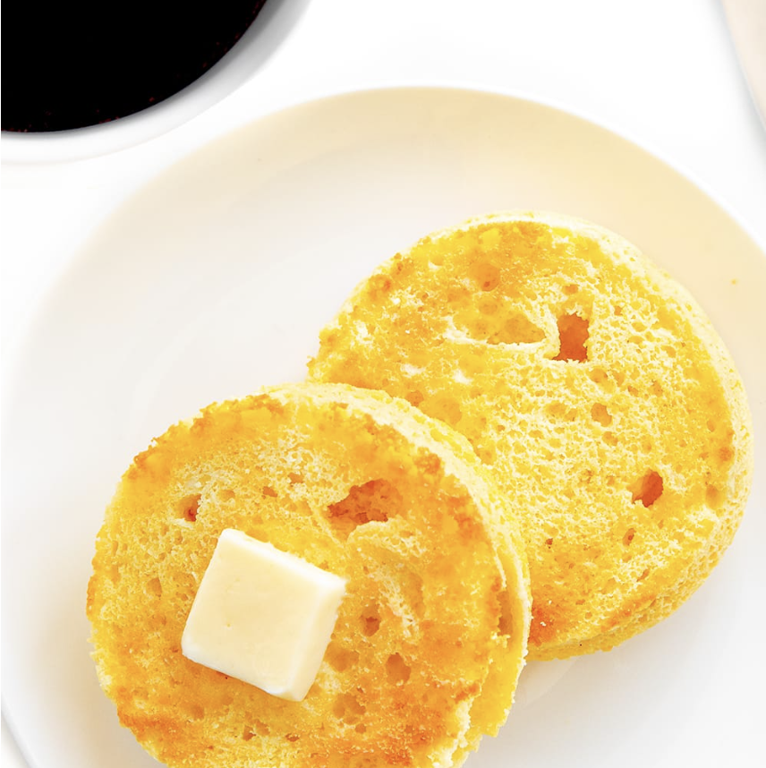

###### *RELATED* : 
---
This paleo, gluten-free, low carb English muffin is soft and buttery inside, crusty on the outside. Easy to make in just 2 minutes, with 5 ingredients!

---
## PREP | COMMENTS

**Prep Time** 2 minutes
**Cook Time** 3 minutes
**Total Time** 5 minutes

---
# INGREDIENTS

- [ ] 3 tbsp [Almond flour](https://www.wholesomeyum.com/product/B00IDLV6OM/US/wholyum-20/)
- [ ] 1/2 tbsp [Coconut flour](https://www.wholesomeyum.com/product/B00IDCFXG8/US/wholyum-20/)
- [ ] 1 tbsp [Butter](https://www.wholesomeyum.com/product/B01AYUZN66/US/wholyum-20/) (or ghee, or coconut oil)
- [ ] 1 large Egg (or equivalent egg whites)
- [ ] 1 pinch [Sea salt](https://www.wholesomeyum.com/product/B0034TY0A0/US/wholyum-20/)
- [ ] 1/2 tsp [Gluten-free baking powder](https://www.wholesomeyum.com/product/B000WGELMA/US/wholyum-20/)

---
# INSTRUCTIONS

1. Melt ghee (or butter) in a microwave safe ramekin or other container, about 4" in diameter with a flat bottom. This takes about 30 seconds.
    
2. Add the remaining ingredients and stir until well combined. Let sit for a minute to allow the mixture to thicken.
    
3. Microwave for about 90 seconds, until firm. Run a knife along the edge and flip over a plate to release. Slice in half, then toast in the toaster.

---
## NOTES

- Nutrition facts below are for a LARGE low carb English muffin (4" diameter). To make a regular sized one, use 2/3 to 3/4 of the recipe and a smaller container.
    
- If you prefer more/smaller slices, you can also make it in a mug instead of a ramekin, then just pop those in the toaster in batches.
    
- A reader suggested using [these rectangular Pyrex containers](https://www.wholesomeyum.com/product/B00JJILWQ0/US/wholyum-20/?cart=y) for this recipe. If you use one of those and then cut it in half, you'll get the perfect size for a sandwich!

---
## TIPS

---
## NUTRITIONS

---
### *EXTRA* :

