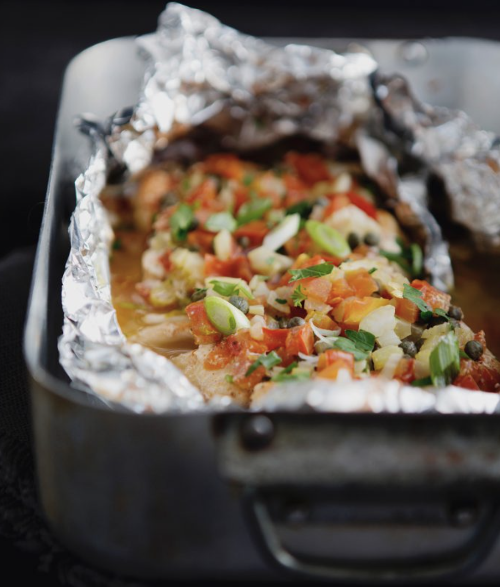

###### *RELATED* : 
---

---
## PREP | COMMENTS

PRÉPARATION _10 min_
CUISSON_20 min_
REPOS _5 min_
CONGÉLATION _Ne se congèle pas_
CONSERVATION _2 à 3 jours au réfrigérateur_

---
# INGREDIENTS

- [ ] 4 filets d’aiglefin d’environ 120 g chacun (ou de poisson blanc au choix)
- [ ] Sel de céleri et poivre, au goût
- [ ] 1/2 c. à thé de paprika
- [ ] 2 oignons verts, tranchés finement
- [ ] 1 tasse de tomate fraîche, coupée en dés
- [ ] 1/2 tasse de céleri, tranché finement
- [ ] 1/4 de tasse de câpres, égouttées
- [ ] 1/4 de tasse de vin blanc
- [ ] 2 c. à soupe de beurre

---
# INSTRUCTIONS

1. Préchauffer le four à 400 °F et placer la grille au centre. Couper un rectangle de papier d’aluminium de 15 po, puis réserver sur une plaque à cuisson.
2. Assaisonner chaque filet d’aiglefin de sel de céleri, de poivre et de paprika.
3. Déposer les filets au centre du papier d’aluminium, puis garnir le dessus avec le reste des ingrédients. Refermer hermétiquement le papier d’aluminium afin de former une papillote.
4. Cuire au four de 20 à 25 minutes. Retirer du four et attendre quelques minutes avant d’ouvrir la papillote pour servir.

---
## NOTES

_Pour refermer la papillote, tirer 2 côtés du papier d’aluminium vers le haut et les joindre au-dessus du poisson. Replier les côtés de 2 à 3 fois sur eux-mêmes afin de bien sceller la papillote, puis rouler le papier jusqu’au poisson. Fermer ensuite les extrémités du papier en les tordant._ 

Pour la recette suivante, voir les commentaires de Marise  plus bas.

---
## TIPS

---
## NUTRITIONS

---
### *EXTRA* :

