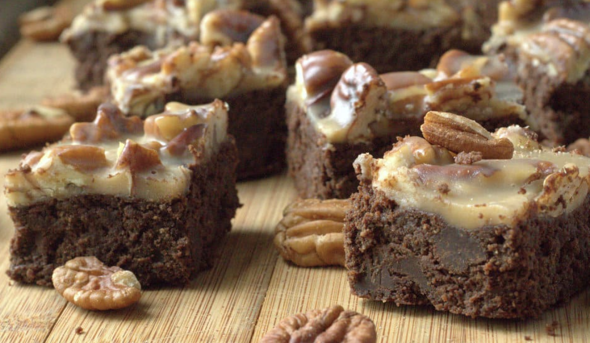

###### *RELATED* : 
---
They Pecan Praline Brownies are fudgy, full of chocolate chips, and covered with a layer of pecan praline. Low Carb, Keto, Grain Gluten Sugar-Free, THM S.

---
## PREP

---
# INGREDIENTS

- [ ] 4 oz [unsweetened chocolate](http://amzn.to/2ELINng)
- [ ] ¾ cup butter (1.5 sticks)
- [ ] 1 cup [Joy Filled Eats Sweetener (or see alternatives in recipe notes)](https://joyfilledeats.com/sweetener/)
- [ ] 3 eggs
- [ ] 1 teaspoon [vanilla](https://rstyle.me/+qYk1SY8fcrGmijMnOVUl9g)
- [ ] 3 tablespoon [almond flour](https://rstyle.me/+OHcVCzIVR85Qn8KxUcWYFg)
- [ ] 3 tablespoon [coconut flour](https://rstyle.me/+2ZVvqErg1_Zik64hkoTaYw)
- [ ] 2 tablespoon [ground golden flax](https://rstyle.me/+Olph9ySapei0LFQFdzOKYA) (or additional almond flour)
- [ ] 1 cup [sugar free chocolate chips](https://amzn.to/3reQUFW)
- [ ] [One recipe of my Creamy Pecan Pralines](https://joyfilledeats.com/creamy-pecan-pralines/) , cooled to room temperature in the saucepan

---
# INSTRUCTIONS

1. Preheat oven to 350. Line a 7 x 10 baking dish with foil and spray with cooking spray.
2. Melt the chocolate and butter in a glass bowl in the microwave. Add the next four ingredients and stir until smooth. Add the chocolate chips.
3. Pour into the prepared baking pan and spread evenly. Bake for 30-35 min until no longer jiggly. Cool for 10 minutes.
4. Spoon the prepared pecan praline on top. Refrigerate until set and cut into squares.

---
## NOTES

#### **Notes on Sweeteners:** 

I use my own blend of xylitol, erythritol, and stevia in my recipes. This is twice as sweet as sugar. It is comparable to Trim Healthy Mama Gentle Sweet and Truvia.

To sub in Swerve or Lakanto Monk Fruit use 1.5 times the amount of sweetener called for. 

To sub in Pyure or Trim Healthy Mama Super Sweet use half the amount of sweetener called for.

Substitutions will work in most recipes. They may not work in candies, such as caramel.

---
## TIPS

---
## NUTRITIONS

Calories: 123 | Carbohydrates: 3g | Protein: 2g | Fat: 12g | Saturated Fat: 7g | Cholesterol: 35mg | Sodium: 60mg | Potassium: 94mg | Fiber: 1g | Vitamin A: 205IU | Calcium: 20mg | Iron: 2mg

---
### *EXTRA* :

