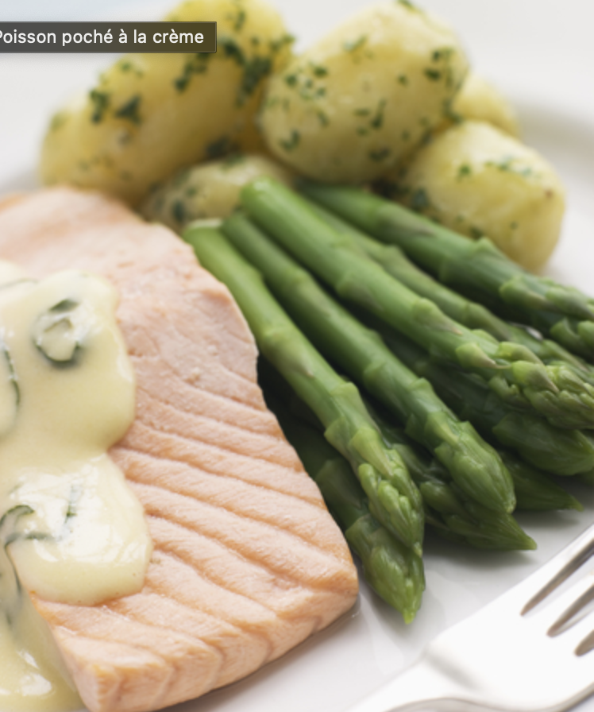

###### *RELATED* : 
---
Une recette du restaurant Mille fleurs de l’hôtel Mocking Bird Hill, à Port Antonio.

---
## PREP | COMMENTS

---
# INGREDIENTS

- [ ] 2   gousses d’ail hachées
- [ ] 6   oignons verts hachés
- [ ] 200 ml (3/4 tasse)  de vin blanc
- [ ] 250 g (1 tasse) de crème 35 %
- [ ] Quelques brins de thym
- [ ] 350 g  environ de filets de poisson (vivaneau ou sébaste)
- [ ] le jus de 1 lime
- [ ] Sel et poivre
- [ ] 30 ml (2 c. à soupe)  de beurre
- [ ] 30 ml (2 c. à soupe)  d’huile d’olive
- [ ] 2   oignons hachés

---
# INSTRUCTIONS

1. Mettre les filets de poisson dans une assiette creuse et les arroser avec la moitié du jus de lime. Saler et poivrer. Les retourner, les arroser avec le reste du jus. Saler et poivrer.
2. Chauffer le beurre et l’huile. Y faire dorer l’oignon, l’ail et les oignons verts. Cuire à feu doux, 5 minutes, en remuant souvent. Ajouter le vin et laisser mijoter 5 minutes. Ajouter la crème et le thym. Y déposer les filets et faire mijoter de 5 à 7 minutes ou jusqu’à ce qu’ils soient tendres. Les retourner à mi-cuisson.
3. Variante : on peut préparer ce poisson aux tomates plutôt qu’à la crème. Dans ce cas, avant d’ajouter le vin, incorporer 6 tomates coupées en dés et cuire 5 minutes, en omettant la crème.

---
## NOTES

---
## TIPS

---
## NUTRITIONS

---
### *EXTRA* :

