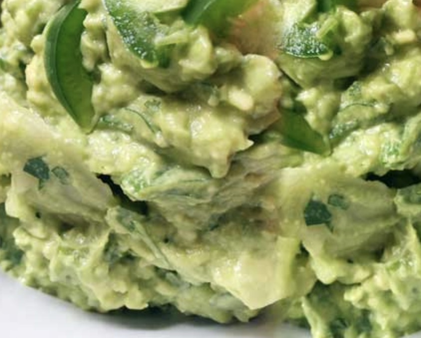

###### *RELATED* : 
---

---
## PREP | COMMENTS

---
# INGREDIENTS

- [ ] 1 small garlic clove, minced
- [ ] 1 scallion or ¼ onion, chopped
- [ ] 2 Tbsp. sauerkraut brine
- [ ] 2 Tbsp. sauerkraut vegetables
- [ ] 3 ripe avocados
- [ ] Handful of fresh cilantro leaves
- [ ] Himalayan salt, to taste
- [ ] Optional: ½ fresh jalapeno, diced small
- [ ] Optional: 1 tsp. fresh lime juice

---
# INSTRUCTIONS

1. In a mixing bowl, add your minced garlic and then top with scallions or onions. Pour the sauerkraut brine over the garlic and scallions. This helps take the edge off.
2. Add the sauerkraut vegetables and/or jalapeno.
3. Slice the avocados in half, remove the pit and carefully slice a checkerboard into the avocado to make smashing easier. Scoop the avocado out of the skin and into the bowl.
4. Add the cilantro and start mixing, from the bottom of the bowl, with a fork. It’s best to leave some chunks of avocado.
5. Taste your guacamole to decide if you would like to add lime or salt. It’s recommended you add 1/8 tsp. of Himalayan salt and 1 tsp. of lime.

---
## NOTES

You can’t go wrong with Mexican cuisine, especially when it comes to the different types of food that you can eat at any time of the day. One particular dish that stands out because of its flavor and simplicity is guacamole, a popular mashed avocado dip.

Versatility is also a strong suit of guacamole, since you can add it to your salads or use it as garnish for burritos, tacos or enchiladas.1

This [Probiotic Guacamole recipe](http://mylongevitykitchen.com/probiotic-guacamole-recipe/) from My Longevity Kitchen is perfect for those who want to refine their current guacamole recipe. What sets this recipe apart from other guacamole recipes, however, is the addition of sauerkraut brine and vegetables that complement the vibrant flavor of the avocado.

---
## TIPS

---
## NUTRITIONS

---
### *EXTRA* :

## This Probiotic Guacamole Is Packed to the Brim With Nutrients

This classic Mexican staple gets a health boost in this Probiotic Guacamole recipe. Some guacamole recipes may be already healthy on their own, especially when organic produce are used, but the tangy and crunchy sauerkraut provides an additional dash of flavor and nutrition to this dip.

## Avocado’s Amazing Health Benefits

When purchasing avocados, choose those that feel heavy, possess dark skins with a green tinge, are taut and do not have any dents.2 If you’re not using the avocados at once, store them in the refrigerator, where they can stay fresh for up to two weeks. Meanwhile, if you have already scooped out some of the fruit, store it along with the pit in an airtight container in the fridge.

Avocados have been hailed as a potent and beneficial superfood for many good reasons. Apart from being low in sodium and fructose, there are a bounty of nutrients you can get from these fruits, such as B vitamins, minerals and healthy monounsaturated fats. Avocados have been proven to:

|   |   |   |
|---|---|---|
|**Possess anti-inflammatory nutrients**: these include carotenoids and phytosterols that can benefit your cardiovascular system3|**Assist in maintaining cholesterol levels in the healthy range**: one study conducted among healthy individuals showed a 16 percent decrease of serum total cholesterol level after eating a week-long diet loaded in monounsaturated fat from avocados4|**Decrease risk for heart disease**: because of its monounsaturated fat content5|
|**Aid in protecting against liver damage:** in a Japanese study, rats were fed avocados and 22 other fruits, followed by a dose of D-galactosamine, a liver toxin that disturbs cell synthesis and leads to cell death.      The results showed that rats fed with avocados suffered the least amount of liver damage6|**Allow the body to more efficiently absorb fat-soluble nutrients from other food that’s eaten along with the fruit:** a 2005 study discovered that volunteers were able to absorb three to five times more carotenoids when they added avocados to their salad7|**Boost lipid profiles among healthy individuals and people with non-optimized HDL or total cholesterol levels:** research revealed that people with elevated cholesterol levels who ate an avocado slashed their serum total cholesterol levels by 17 percent, recorded a 22 percent decrease of LDL cholesterol and triglycerides and increased their HDL cholesterol (good cholesterol) levels by 11 percent8|

## Eat Fermented Foods, and Your Body Will Thank You

Sauerkraut, a German dish made from chopped and pickled [cabbage](https://foodfacts.mercola.com/cabbage.html)9 (although you can use other vegetables), is an ingredient that you won’t find in other guacamole recipes. This fermented vegetable dish (and the brine that goes with it) puts the “probiotic” in this Probiotic Guacamole recipe.

Adding [fermented food](https://articles.mercola.com/fermented-foods.aspx) like sauerkraut to your diet is one of the best decisions that you can make for your health. The fermentation process enhances the nutritional content of the food, courtesy of the bacteria and yeast that are present. As a result, you can reap these essentials for good health:

- Enzymes
- Nutrients such as B vitamins, biotin and folic acid10
- Short-chain fatty acids
- Minerals (fermented food leads to increased bioavailability)

Plus, fermented food is known to produce vast amounts of beneficial bacteria, making this type of food a potent probiotic that may help with:

- Enhancing mental health, mood control and behavior
- Boosting your immune system
- Providing antioxidant11 and detoxifying effects
- Lowering risk for type 1 and type 2 diabetes,12 Alzheimer’s disease and bacterial and pathogenic microorganism infections
- Helping with weight loss

## See for Yourself What Cilantro Can Do

Coriander, or [cilantro](https://articles.mercola.com/sites/articles/archive/2016/03/07/coriander-benefits.aspx) as it is commonly known, definitely has its fair share of health benefits. This aromatic herb is abundant in flavonoids, polyphenols and phenolic acids, particularly the anti-inflammatory antioxidants kaempferol and quercetin. The former assists your body in combatting cancer and decreasing risk for chronic diseases like heart disease and stroke,13 while the latter helps in preventing histamine release.

Arthritis patients can also benefit from cilantro, as the herb was proven to aid in lessening pain brought about by the disease. Cilantro is also a known chelator or remover of heavy metals like mercury from your body. There is evidence that eating cilantro in tandem with foods containing heavy metals could lessen the absorption and toxicity of these harmful substances into your body.14

