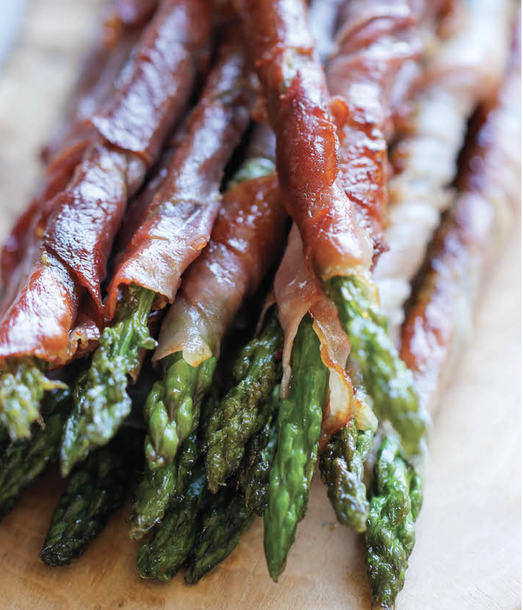

###### *RELATED* : 
---
_The easiest, most tastiest appetizer with just 2 ingredients and 10 min prep!_

---
## PREP | COMMENTS

PREP TIME: 10 MINUTES
COOK TIME: 5 MINUTES
TOTAL TIME: 15 MINUTES

---
# INGREDIENTS

- [ ] 6 ounces sliced prosciutto, halved horizontally
- [ ] 1 pound asparagus, trimmed
- [ ] 1 tablespoon olive oil

---
# INSTRUCTIONS

1. Working one at a time, wrap halved prosciutto slice on each asparagus spear at an angle, covering the entire length of the spear. Repeat with remaining prosciutto and asparagus.
2. Heat olive oil in a large skillet over medium high heat. Add asparagus and cook until prosciutto is crisp and asparagus is tender, about 2-3 minutes.
3. Serve immediately.

---
## NOTES

---
## TIPS

---
## NUTRITIONS

---
### *EXTRA* :

