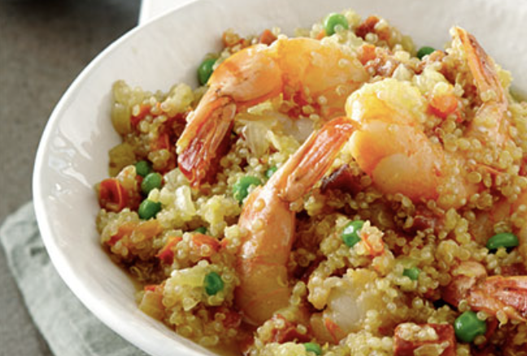

###### *RELATED* : 
---

---
## PREP | COMMENTS

Portion(s) : 4
Préparation : 20 min
Cuisson : 40 min

---
# INGREDIENTS

- [ ] 1/4 c. à thé (1 ml) de filaments de safran
- [ ] 1/2 t (125 ml) de vin blanc sec ou bouillon de poulet réduit en sel
- [ ] 3 c. à tab (45 ml) d'huile d'olive
- [ ] 2 gousses d'ail hachées finement
- [ ] 1 poivron rouge coupé en dés
- [ ] 10 oz (300 g) de crevettes crues, décortiquées et déveinées
- [ ] 4 oz (120 g) de chorizo coupé en dés
- [ ] 1 oignon haché
- [ ] 1 1/2 t (375 ml) de quinoa
- [ ] 6 t (1,5 L) de bouillon de poulet réduit en sel, chaud
- [ ] 1/2 t (125 ml) de petits pois surgelés
- [ ] 1/2 t (125 ml) de parmesan râpé
- [ ] sel et poivre du moulin

---
# INSTRUCTIONS

1. Dans un petit bol, saupoudrer le safran sur le vin. Réserver. 

2. Dans un poêlon, chauffer 1 c. à tab (15 ml) de l'huile à feu moyen-vif. Ajouter l'ail et le poivron rouge et cuire, en brassant, pendant 1 minute. Ajouter les crevettes et le chorizo et cuire, en brassant, pendant 4 minutes ou jusqu'à ce que les crevettes soient cuites. Réserver. 

3. Dans une casserole, chauffer le reste de l'huile à feu moyen. Cuire l'oignon 2 minutes ou jusqu'à ce qu'il ait ramolli (ne pas le faire dorer), en brassant de temps à autre. Ajouter le quinoa et cuire, en brassant, pendant 1 minute. 

4. Verser le vin réservé dans la casserole de quinoa et cuire, en brassant sans arrêt, jusqu'à ce qu'il soit absorbé. À l'aide d'une louche, ajouter 1/2 t (125 ml) de bouillon de poulet chaud, réduire à feu moyen-doux et poursuivre la cuisson jusqu'à ce qu'il soit absorbé en brassant sans arrêt. Ajouter le reste du bouillon de la même manière, 1/2 t (125 ml) à la fois (cuire environ 25 minutes ou jusqu'à ce que le quinoa soit al dente). Ajouter les petits pois et mélanger. Retirer la casserole du feu. Incorporer le parmesan et le mélange de crevettes réservé. Saler et poivrer. Servir aussitôt.

---
## NOTES

---
## TIPS

---
## NUTRITIONS

---
### *EXTRA* :

