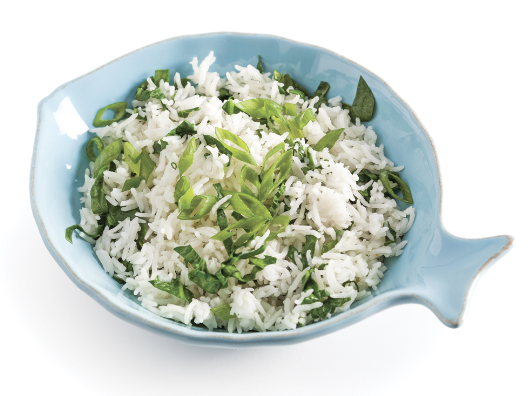

###### *RELATED* : 
---
Parmi les plus parfumés au monde, le riz basmati dépayse à lui seul les papilles. On ajoute des épinards et des oignons verts, et voilà qu'il prend une tout autre allure dans l'assiette!

---
## PREP | COMMENTS

- SERVES4
- PREP TIME15 minutes
- COOK TIME18 minutes

---
# INGREDIENTS

- [ ] 250 ml (1 tasse) de riz basmati
- [ ] 250 ml (1 tasse) d’ épinards émincés
- [ ] 2 oignons verts émincés

---
# INSTRUCTIONS

1. Rincer et égoutter le riz. Déposer dans une casserole avec 500 ml (2 tasses) d’eau salée. Porter à ébullition.
    
2. Couvrir et cuire à feu doux-moyen de 18 à 20 minutes. Ajouter les épinards 5 minutes avant la fin de la cuisson du riz.
    
3. Parsemer d’oignons verts.

---
## NOTES

---
## TIPS

---
## NUTRITIONS

---
### *EXTRA* :

