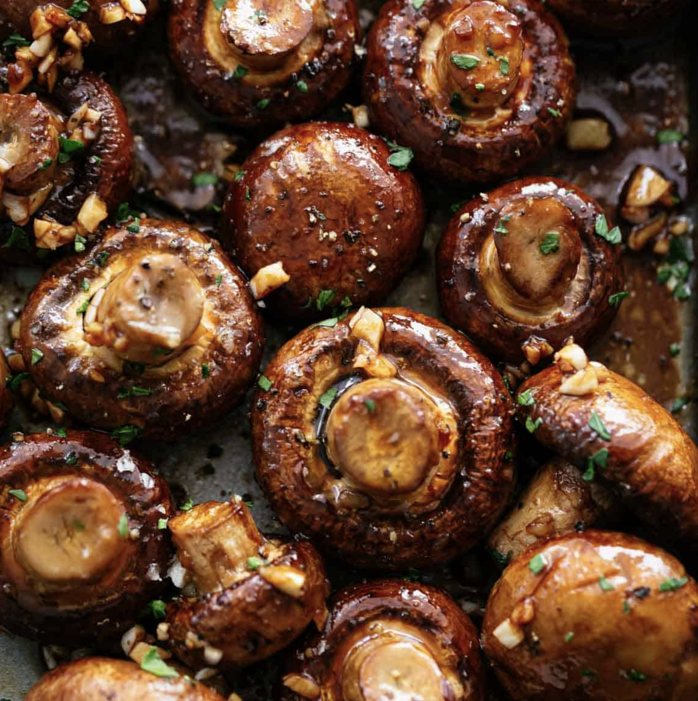

###### *RELATED* : 
---
Deliciously easy roasted mushrooms in a balsamic and garlic soy glaze! A stand out side or main for your dinner table!

---
## PREP | COMMENTS

---
# INGREDIENTS

- [ ] 2pounds(1 kg) mushrooms
- [ ] 1tablespoonunsalted butter,melted
- [ ] 1tablespoonoil
- [ ] 3tablespoonsbalsamic vinegar
- [ ] 2tablespoonssoy sauce
- [ ] 4clovesgarlic,minced or chopped
- [ ] 1/2teaspoonparsley,chopped
- [ ] 1/2teaspoonthyme,(or rosemary)
- [ ] 1/2teaspoonbrown sugar,(omit for low carb or KETO)
- [ ] Coarse salt
- [ ] Cracked black pepper, to taste

---
# INSTRUCTIONS

1. Preheat oven to 400°F (200°C).
2. Lightly grease a large baking sheet/pan with nonstick cooking oil spray.
3. Wipe mushrooms over with a damp sheet of paper towel to clean off dirt and debris.
4. In a large bowl, combine the mushrooms with the melted butter, oil, balsamic vinegar, soy sauce, garlic, parsley, thyme, brown sugar, salt and pepper. Toss to evenly coat.
5. Arrange mushrooms in a single layer on prepared baking sheet.
6. Roast in hot oven for 15-20 minutes, mixing them halfway through cooking, until tender.

---
## NOTES

Calories: 154kcal | Carbohydrates: 11g | Protein: 8g | Fat: 10g | Saturated Fat: 4g | Fiber: 2g | Sugar: 6g

---
## TIPS

---
## NUTRITIONS

---
### *EXTRA* :

