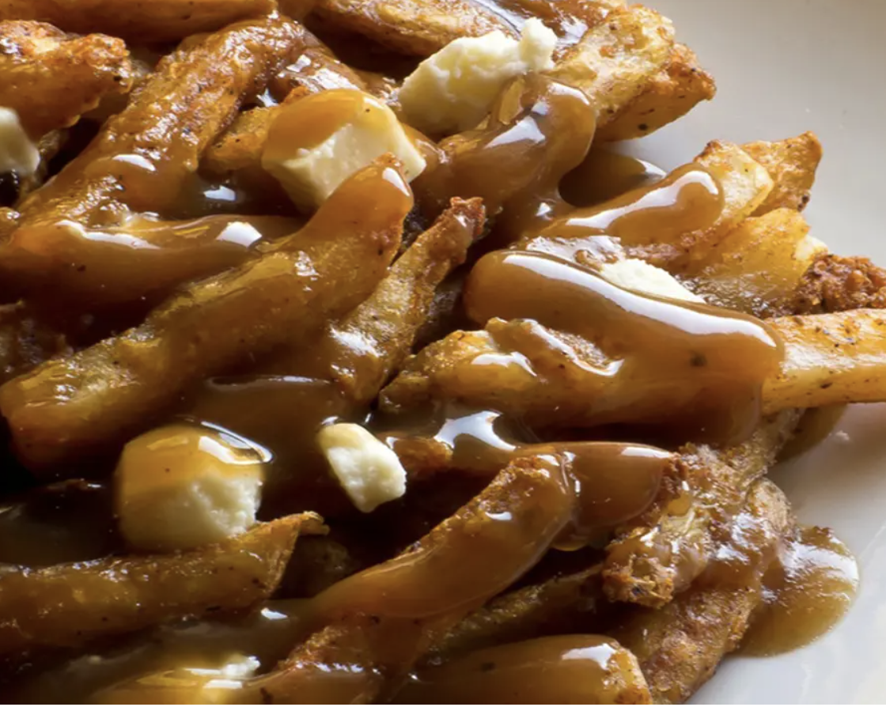

###### *RELATED* : 
---

---
## PREP | COMMENTS

---
# INGREDIENTS

- [ ] [Essai le 6 octobre 2017 (J’ai ajouté 3 c. tab d’eau, 2 c. tab de miel et environ 5 gouttes de tabasco à la fin]
- [ ] 1 gousse d’ail
- [ ] 1/4 tasse (65 ml) de beurre
- [ ] 1/4 tasse (65 ml) de farine
- [ ] 2 boîtes (10 onces) de consommés de bœuf
- [ ] 3/4 d'une boîte de bouillon de poulet condensé 
- [ ] 3 cuillères à soupe de fécule de maïs
- [ ] 3 cuillères à soupe d’eau fraîche
- [ ] 3 cuillères à soupe ketchup
- [ ] 5 gouttes de tabasco
- [ ] Sel et poivre

---
# INSTRUCTIONS

1. Dans une casserole, faire chauffer le beurre, l’ail et la farine pendant 2 minutes, en remuant souvent.
    
2. Ajouter les consommés de bœuf et le 3/4 d'une boîte de bouillon de poulet. Portez à ébullition et laissez mijoter 2 minutes.
    
3. Ajouter la fécule de maïs, l’eau, le ketchup et le tabasco.
    
4. Laissez mijoter pendant environ 5 minutes.

---
## NOTES

---
## TIPS

---
## NUTRITIONS

---
### *EXTRA* :

