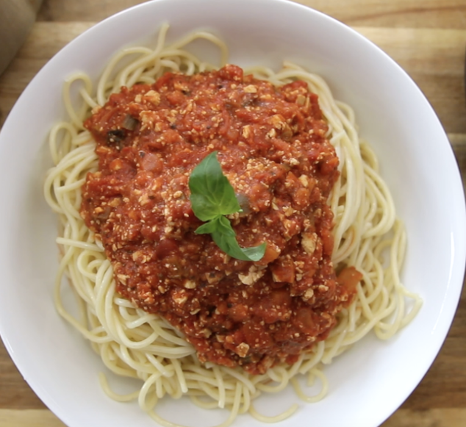

###### *RELATED* : 
---

---
## PREP | COMMENTS

---
# INGREDIENTS

- [ ] 1 bloc de 450 de tofu ferme (16 oz) [essai avec 2 lbs ; attention de ne pas les défaire trop au robot pcq fait de la sauce rosée et manque de texture, utiliser une moulinette]
- [ ] 1/4 de tasse d’huile d’avocado) [pas besoin de autant 2 c. tab.]
- [ ] 1 oignon haché [2]
- [ ] 3 branches de céleri émincées [4]
- [ ] 2 carottes hachées [3]
- [ ] 1/4 de tasse de sauce soya (60 ml) [même]
- [ ] 1/4 de tasse de cassonade, **de sucre de canne** ou de sirop d’érable (60 ml)
- [ ] [1 c. tab vinaigre de cidre]
- [ ] 3 gousses d’ail hachées [5]
- [ ] 3 c à soupe d’assaisonnement italien (basilic, thym et origan)
- [ ] 3 feuilles de Laurier
- [ ] 1 c à thé de piment rouge broyé (5 ml)
- [ ] 3 boîtes de tomates en dés de 28 oz chacune
- [ ] 4 c à soupe de pâte ou purée de tomate (60 ml)
- [ ] 1 pot de 16,9 oz / 500 ml de piments rouges rôtis, égouttés et broyés
- [ ] sel et poivre au goût

---
# INSTRUCTIONS

1. [Broyer le tofu dans une moulinette. Assaisonner avec sauce soya, vinaigre de cidre, 1 c. thé chacuns (basilic, thym, origan). Faire cuire dans une poêle jusqu'à ce qu'il brunisse.] Réserver.
2. Dans une grande casserole, faire chauffer l’huile. Ajouter l’oignon, le céleri, les carottes et le sel. Faire cuire à feu mi-vif jusqu’à ce que les légumes commencent à attendrir (environ 15 minutes).
3. Ajouter la sauce soya, le sucre, l’ail haché, l’assaisonnement italien [2 c. thé chacuns (basilic, thym, origan], le piment rouge broyé et les tomates en conserves, la pâte de tomate et les piments rouges broyés. Ajouter le tofu lorsqu'il est un peu rôti.
4. Laisser mijoter 90 minutes, à feu doux, en brassant de temps à autre.
5. Saler et poivrer au goût.
6. Servir sur les pâtes de votre choix.

---
## NOTES

---
## TIPS

---
## NUTRITIONS

---
### *EXTRA* :

