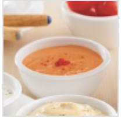

## NOTES

## PREP

# INGREDIENTS

80 ml (1/3 de tasse) de sauce chili thaï épicée 60 ml (1/4 de tasse) de crème sure 15 ml (1 c. à soupe) de gingembre haché 10 ml (2 c. à thé) de sauce sriracha 5 ml (1 c. à thé) d’ail haché Sel et poivre au goût

# INSTRUCTIONS

Dans un bol, mélanger tous les ingrédients. Réserver au frais.

## TIPS

