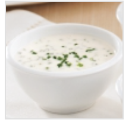

## NOTES

## PREP

# INGREDIENTS

125 ml (1/2 tasse) de mayonnaise 60 ml (1/4 de tasse) de crème sure 45 ml (3 c. à soupe) de fines herbes au choix 15 ml (1 c. à soupe) de miel 15 ml (1 c. à soupe) de jus de lime 5 ml (1 c. à thé) d’ail haché Sel et poivre au goût

# INSTRUCTIONS

Dans un bol, mélanger tous les ingrédients. Réserver au frais.

## TIPS

