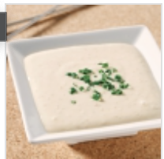

## NOTES

## PREP

# INGREDIENTS

30 ml (2 c. à soupe) de graines de sésame 180 ml (3/4 de tasse) de vinaigrette japonaise (de type Wafu) 60 ml (1/4 de tasse) de crème sure 15 ml (1 c. à soupe) de ciboulette hachée Sel et poivre au goût

# INSTRUCTIONS

Dans une poêle antiadhésive, faire griller les graines de sésame à feu moyen. Remuer régulièrement jusqu’à ce que les graines soient bien dorées. Laisser tiédir.

Dans un bol, mélanger les autres ingrédients, puis incorporer les graines de sésame au reste des ingrédients. Réserver au frais.

## TIPS

