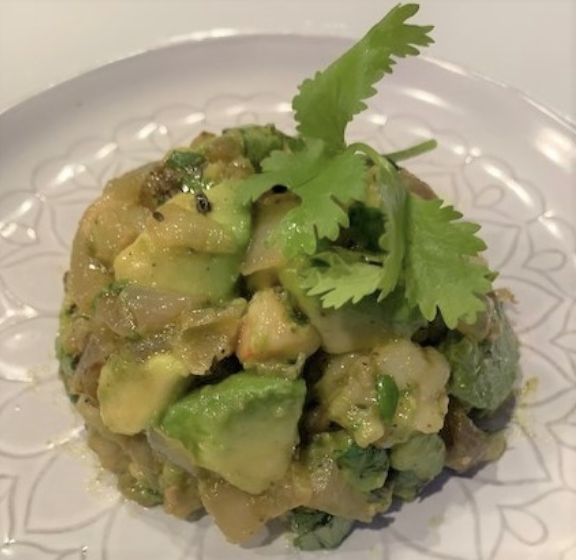

###### *RELATED* : 
---

---
## PREP | COMMENTS

---
# INGREDIENTS

- [ ] 2 tablespoons extra-virgin olive oil
- [ ] 1 medium white onion, chopped finely
- [ ] ¼ teaspoon sea salt
- [ ] ¼ teaspoon ground black pepper
- [ ] ½ teaspoon dried thyme
- [ ] ½ pound shrimp, peeled, deveined, and chopped
- [ ] 2 tablespoons fresh cilantro, chopped
- [ ] 1 tablespoon lime juice
- [ ] Optional, 1/8 teaspoon dried cayenne powder
- [ ] 1 Haas avocado, diced into ½-inch pieces

---
# INSTRUCTIONS

1. Heat a sauté pan to medium heat, add olive oil, then onion and heat for 3 minutes with an occasional stir until the onion softens, add salt, black pepper, thyme, and shrimp, and heat another 3 minutes with occasional stirring until shrimp are cooked.
2. Transfer to a bowl and toss with cilantro and lime juice. If you enjoy spicy heat, add the optional cayenne powder. Stir in avocado.
3. To serve, spoon mixture into small bowls and gently pack contents to the bottom. Invert bowls over a salad plate.
4. Garnish with a sprig of cilantro and/or a whole shrimp. Serve immediately.
5. If serving later, drizzle lemon juice over the mound, then cover and refrigerate.
6. Enjoy,

---
## NOTES

---
## TIPS

---
## NUTRITIONS

---
### *EXTRA* :

