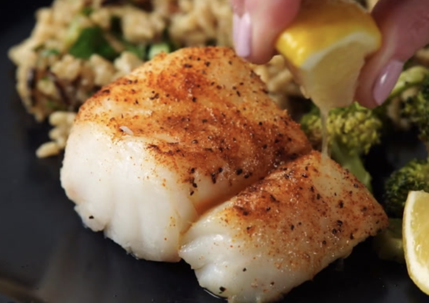
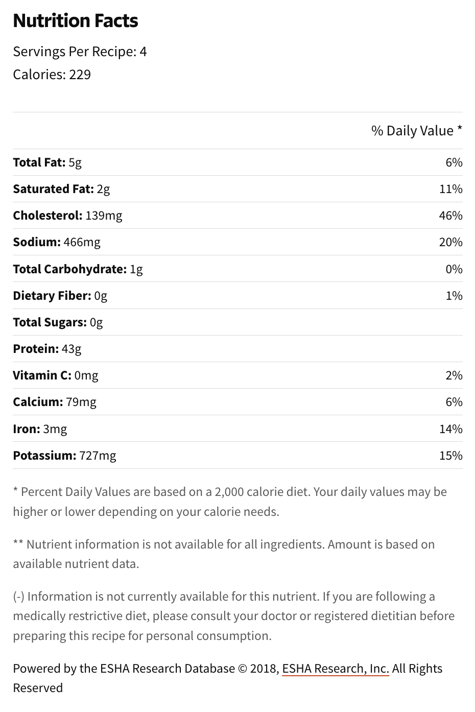

###### *RELATED* : 
---
This haddock recipe is very quick and easy to make. A blend of seasonings spices up the mild flavor of this wonderfully light and flaky white fish.

---
## PREP | COMMENTS

[Pourrait aussi être bon avec de la **mayonnaise citron-anchois (Voir recette: Filet de sole et sauce mayonnaise citron-anchois)**]

---
# INGREDIENTS

- [ ] 2 pounds haddock fillets
- [ ] ½ teaspoon onion powder
- [ ] ½ teaspoon paprika
- [ ] ½ teaspoon garlic powder
- [ ] ½ teaspoon ground black pepper
- [ ] ½ teaspoon salt
- [ ] ¼ teaspoon cayenne pepper
- [ ] 1 tablespoon butter, cut in small pieces
- [ ] 1 lemon, cut into wedges

---
# INSTRUCTIONS

1. Set an oven rack about 6 inches from the heat source and preheat the oven's broiler. Line a baking sheet with aluminum foil; spray with cooking spray.
    
2. Arrange haddock fillets on the prepared baking sheet.
    
3. Mix onion powder, paprika, garlic powder, black pepper, salt, and cayenne pepper in a small bowl; sprinkle seasoning over fish, then dot with butter.
    
4. Broil in the preheated oven until fish flakes easily with a fork, 6 to 8 minutes. Serve with lemon wedges.

---
## NOTES

---
## TIPS

---
## NUTRITIONS

---
### *EXTRA* :

