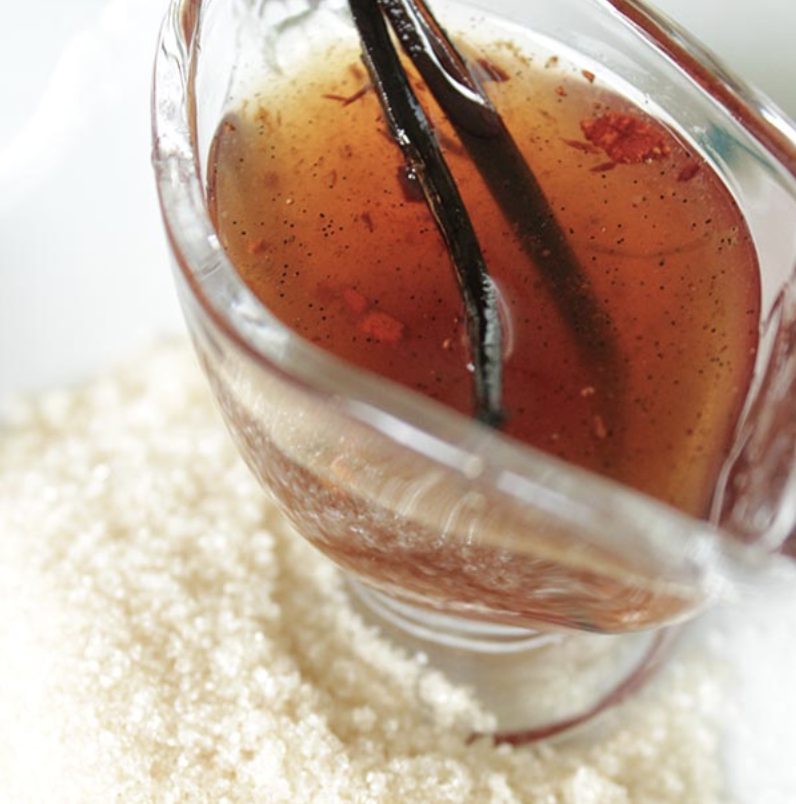
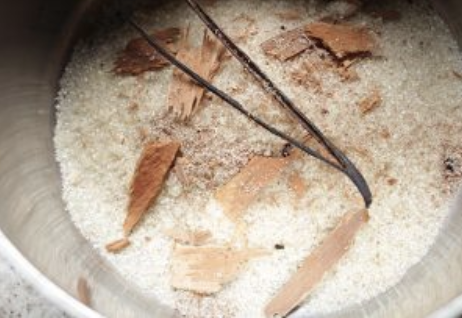
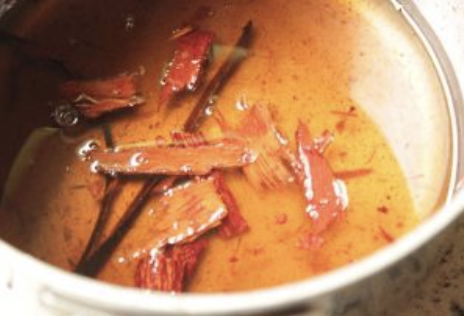

###### *RELATED* : 
---

---
## PREP | COMMENTS

---
# INGREDIENTS

- [ ] 280g sucre de canne
- [ ] 540 ml eau
- [ ] 6 pincées de muscade
- [ ] 1 belle gousse de vanille (ou  plusieurs) - [[Vanille - Bouteille pour extrait de vanille - Madagascar]]
- [ ] 2 bâtons de cannelle (ou l'équivalent)

---
# INSTRUCTIONS

1. Dans une casserole, mettez le sucre de canne, la gousse de vanille fendue en deux, la cannelle et la muscade

2. Ajoutez l’eau et mettez a fondre et infuser l'ensemble sur petit feu pendant 40 minutes jusqu’a obtenir une texture qui nappe la cuillére.
3. NB : si votre feu est trop fort, votre sirop peut réduire plus que nécessaire. Dans ce cas, ajustez en ajoutant de l’eau.

---
## NOTES

Filtrez votre sirop de canne avant de Iutiliser pour vos préparations. ..et conservez-le dans un bocal hermétique au réfrigérateur.

---
## TIPS

---
## NUTRITIONS

---
### *EXTRA* :

