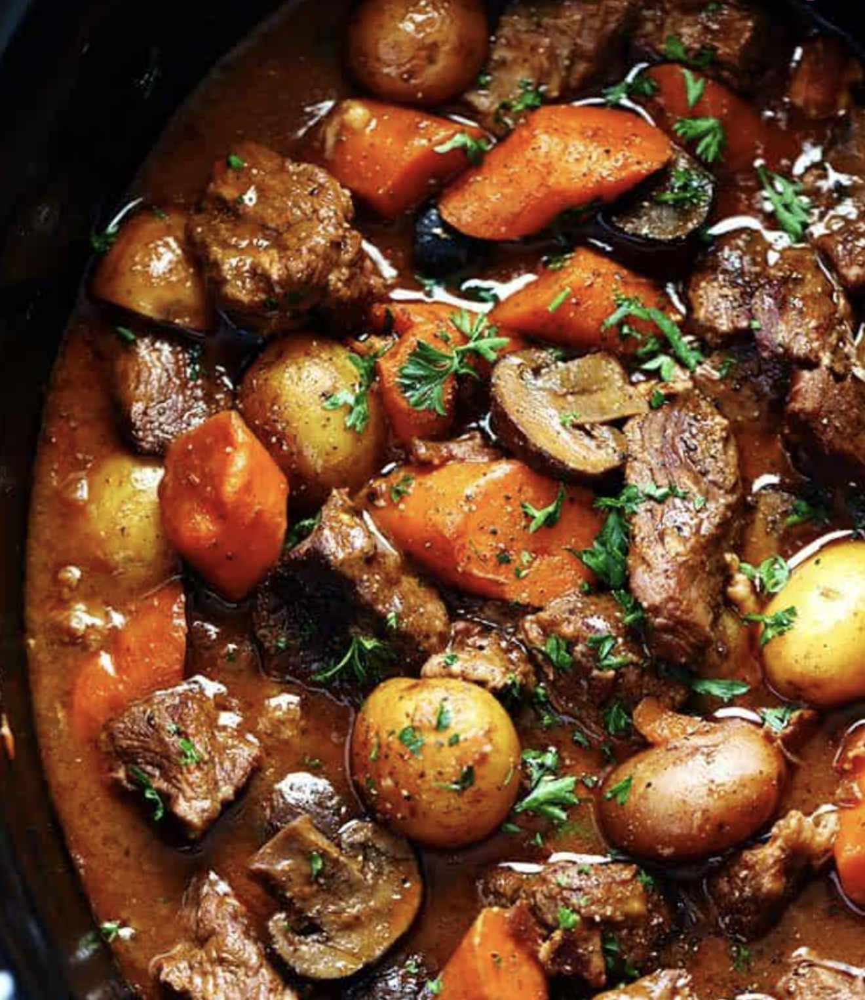
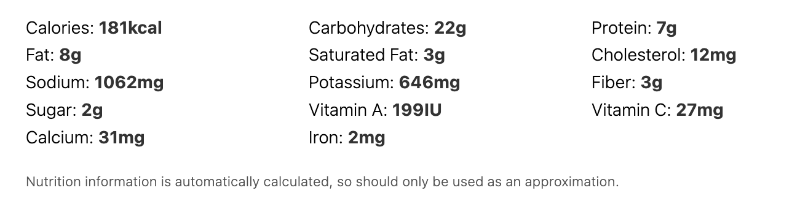

Slow Cooker Beef Bourguignon has crazy tender melt in your mouth beef and hearty veggies slow cooked to perfection in a rich sauce. This meal is comforting and perfect for the cold months ahead!

## PREP

 **(Super bon, pourrait être un repas de fête) 
 Dernière fois servi avec des fèves vertes cuites à la vapeur et pommes de terre pilées)**

### Equipment

- Want to make this even easier? Here are a few products that I LOVE:
    
- Staub Cast Iron Skillet
    
- Instant Pot
    
- The Recipe Critic Whisk

# INGREDIENTS

•    
5 slices bacon finely chopped [J'ai mis du lard salé]

•    
3 lbs. boneless beef chuck cut to 1 inch cubes

•    
1 cup red cooking wine

•    
2 cups chicken broth [J’ai utilisé du bouillon de boeuf]

•    
1/2 cup tomato sauce [J’en ai mis plus] 680 ml 18 octobre 2022 pour 2 recettes

•    
1/4 cup soy sauce

•    
1/4 cup flour **[arrowroot dilué dans la sauce soya]**

•    
3 garlic cloves finely chopped

•    
2 Tablespoons thyme finely chopped (moitié séché)

[Ajout de feuilles de Laurier (3) et romarin (1 c. tab pour 2 recettes 18 octobre]

•    
5 medium Carrots sliced

•    [Ajout de 1 oignon coupé fin]

[Panais x7 (1 paquet)]

•    
1 pound baby potatoes I used tri color (Je n’ai pas mis le pommes de terre dans le crock pot pour ne pas qu’elle deviennent trop molles)

•    
8 ounce fresh mushrooms sliced [1 1/2 lb Coupés en 1/4 pour 2 recettes] ou doubler

•    
fresh chopped parsley for garnish

# INSTRUCTIONS

1 In a large skillet (chaudron) cook bacon  (lard salé) over medium high heat until crisp. Salt and pepper the beef and add to the skillet (chaudron) and sear on each side for 2-3 minutes. Transfer beef to the slow cooker.
 Put the meat aside.

3    Add the red wine to the skillet (chaudron) scraping down the brown bits on the side. Allow it to simmer and reduce and slowly add chicken broth, and tomato sauce, and soy sauce (where the arrowroot is). Remettre la viande.

4    Add onions, garlic, thyme, carrots, [NO : potatoes], and mushrooms (faire cuire les champignons dans une poele pour sauver du temps et réduire la quantité de liquide créée)  Give it a good stir and cook on low until beef is tender for 1-1é2 to 2 hours  dans un chaudron (8-10 hours or high for 6)

Garnish with fresh parley and serve with mashed potatoes if desired.

## NUTRITIONS

## NOTES

## TIPS

### *EXTRA*

