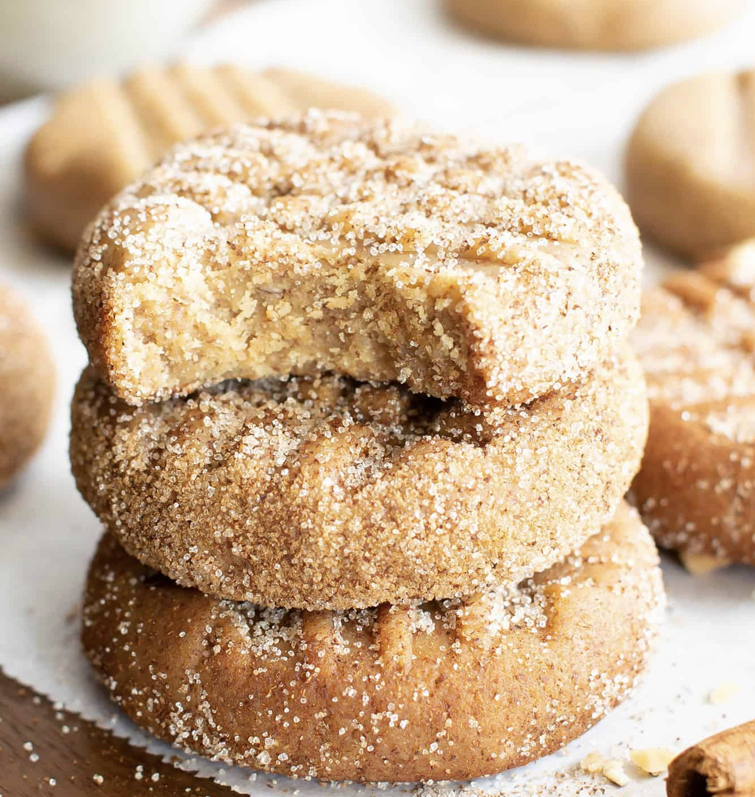
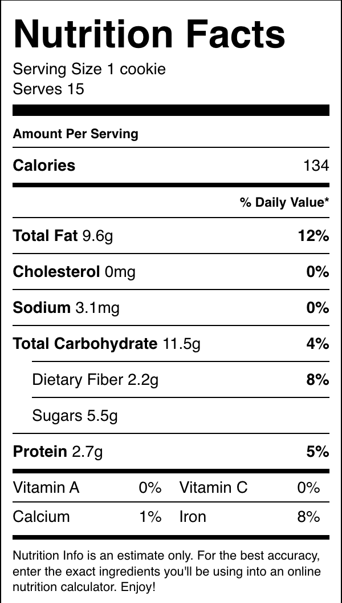

###### *RELATED* : 
---
No Bake Snickerdoodle Cookies (V, GF): just 5 ingredients for easy Vegan + Gluten Free snickerdoodle cookies! These chewy, cinnamon-spiced cookies are sweet, Grain-Free, Refined Sugar-Free, Dairy-Free, No Cook.

---
## PREP | COMMENTS

---
# INGREDIENTS

#### **Snickerdoodle Cookies**

- [ ] 1 cup natural, unsalted [creamy cashew butter](https://beamingbaker.com/recommends/cashew-butter/ "Cashew Butter") (try [homemade cashew butter](https://beamingbaker.com/how-to-make-homemade-cashew-butter-recipe-tutorial/))
- [ ] 5 tablespoons [pure maple syrup](https://beamingbaker.com/recommends/maple-syrup/ "Coombs Farms Pure Maple Syrup")
- [ ] ½ cup [coconut flour](https://beamingbaker.com/recommends/organic-coconut-flour-4lbs/ "Organic Coconut Flour 4lbs")
- [ ] ½ teaspoon ground cinnamon
- [ ] 1 teaspoon pure vanilla extract (optional)

#### **Snickerdoodle Coating**

- [ ] ½ teaspoon ground cinnamon
- [ ] ¼ cup [granulated monkfruit sweetener](https://beamingbaker.com/recommends/granulated-monkfruit-sweetener-1lb-classic/ "Granulated Monkfruit Sweetener 1lb - Classic") or organic cane sugar

---
# INSTRUCTIONS

1. Line a [baking sheet](https://beamingbaker.com/recommends/cookie-sheet/ "Baking Sheet") with [parchment paper](https://beamingbaker.com/recommends/unbleached-parchment-paper/ "Unbleached Parchment Paper") or wax paper. Clear some space in the freezer for this sheet. Set aside at room temperature.
2. In a medium bowl, add all **Snickerdoodle Cookies** ingredients: cashew butter, maple syrup, [coconut flour](https://amzn.to/3vmYVI2), cinnamon and vanilla. Use a rubber spatula to fold until well incorporated and thickened. Cover bowl and freeze for 15-20 minutes.
3. Remove from freezer. Using a cookie scoop, scoop and drop balls onto the prepared baking sheet, spaced evenly apart. Here are the [small](https://beamingbaker.com/recommends/1-tablespoon-cookie-scoop/ "Small Cookie Scoop") and [medium cookie scoops](https://beamingbaker.com/recommends/2-tablespoon-cookie-scoop/ "Medium Cookie Scoop") I use.
4. Using a fork, flatten cookies to desired thickness. Optionally, make additional fork marks in the opposite direction for a crisscross pattern on the cookies.
5. Transfer back to the freezer to chill for 20-30 minutes, until somewhat firm.*
6. Add cinnamon and [monkfruit sweetener](https://beamingbaker.com/recommends/granulated-monkfruit-sweetener-1lb-classic/ "Granulated Monkfruit Sweetener 1lb - Classic") (or sugar) to a small bowl. Stir together until well mixed. Drop and press cookie down into mixture, allowing cinnamon sugar to adhere to cookie. Flip and rotate cookie to coat. Place cookie back onto baking sheet. Repeat for all cookies. Enjoy! Storing instructions below.

---
## NOTES

- *Cookies will become firmer and less moist the next day.
- **Where to Buy Ingredients**: [Unsalted, Natural Creamy Cashew Butter](https://beamingbaker.com/recommends/cashew-butter/ "Cashew Butter") | [Pure Maple Syrup](https://beamingbaker.com/recommends/maple-syrup/ "Coombs Farms Pure Maple Syrup") | [Coconut Flour](https://beamingbaker.com/recommends/organic-coconut-flour-4lbs/ "Organic Coconut Flour 4lbs") | [Pure Vanilla Extract](https://beamingbaker.com/recommends/pure-vanilla-extract/ "Pure Vanilla Extract") | [Granulated Monkfruit Sweetener](https://beamingbaker.com/recommends/granulated-monkfruit-sweetener-1lb-classic/ "Granulated Monkfruit Sweetener 1lb - Classic")
- **Storing Notes**: Store in an airtight container at room temperature or in the refrigerator for 1-2 weeks.
- **Freezing Instructions:** Store in an airtight container in the freezer for 1-2 months. Firm, but soft enough to eat straight out of the freezer.
- **Recommended** **Tools**: [Small](https://beamingbaker.com/recommends/1-tablespoon-cookie-scoop/ "Small Cookie Scoop") or [Medium Cookie Scoop](https://beamingbaker.com/recommends/2-tablespoon-cookie-scoop/ "Medium Cookie Scoop") | [Mixing Bowls](https://beamingbaker.com/recommends/glass-mixing-bowls/ "Glass Mixing Bowls") | [Unbleached Parchment Paper](https://beamingbaker.com/recommends/unbleached-parchment-paper/ "Unbleached Parchment Paper") | [My Favorite Prep Bowls](https://beamingbaker.com/recommends/4oz-prep-bowls/ "4oz Prep Bowls")

---
## TIPS

---
## NUTRITIONS

---
### *EXTRA* :

