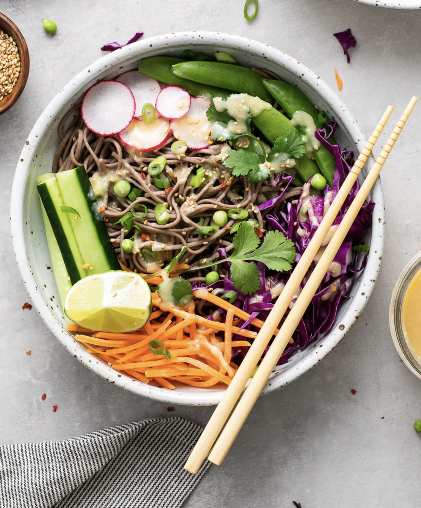
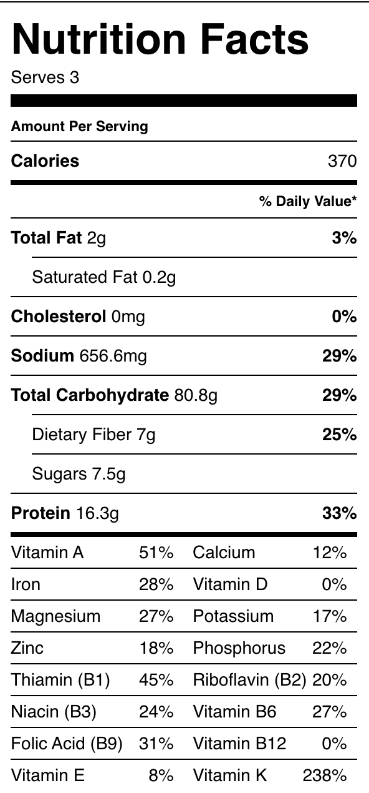

###### *RELATED* : 
---
Rich in protein and fiber, this quick and easy 100% soba noodle bowl with fresh veggies and miso dressing is simple, healthy and delicious!

---
## PREP | COMMENTS

Prep Time: 10 min Cook Time: 10 min Total Time: 20 minutes

---
# INGREDIENTS

- [ ] 1 package (8 or 9 oz.) **soba noodles**
- [ ] 1 cup **sugar snap peas**
- [ ] 1 cup **carrots**, shredded
- [ ] 1 cup **cucumber**, sliced
- [ ] 1 cup **red cabbage**, shredded
- [ ] 3 **radishes**, sliced
- [ ] 2 **scallions** (green onions), sliced, to garnish
- [ ] **sesame seeds** (toasted, black or white), to garnish
- [ ] handful **cilantro sprigs**, to serve
- [ ] **lime wedges**, to serve

#### Miso Sauce

- [ ] 2 – 3 tablespoons **mellow miso paste** (white miso)
- [ ] 2 tablespoons **rice wine vinegar**
- [ ] 3 tablespoons **water**, + more as needed to thin
- [ ] 1 inch knob of **ginger**, grated or minced
- [ ] juice of 1 **lime** (about 1 tablespoon)
- [ ] pinch of **red pepper flakes**

---
# INSTRUCTIONS

#### **Noodles:** 
1. Cook soba noodles according to package directions. Drain and rinse the soba noodles under cool running water (this helps them to not turn mushy!). (Note: _If using 100% soba noodles, careful to watch the water after 2 minutes or so, it will start to become foamy and bubble over – turn the heat to medium and back up again as needed to keep the water at a boil but not boiling over.)_

#### **Miso Sauce:** 
1. In a small bowl, whisk together the miso sauce ingredients together, set aside.

#### **Assemble:** 
1. Serve noodles in individual bowls with 1/3 cup each sugar snap peas, shredded carrots, cucumber, and red cabbage. Top with radishes, sliced scallions, sesame seeds, cilantro and lime wedges to squeeze over top. Drizzle dressing overtop and enjoy!

#### **Store:** 
1. Leftovers can be kept in the refrigerator for up to 4 days in a covered container.

---
## NOTES

For more protein, add a serving of crispy tofu or edamame.

**Soy-free:** If you have soy allergies, try using other miso’s which don’t contain soy such as chickpea miso.

**Soba Noodles:** You can purchase 100% buckwheat noodles by [Eden Buckwheat Noodles](https://amzn.to/3ax7W4v) or [King Soba Noodles](https://amzn.to/3cwlZJk) from Amazon (affiliate links).

---
## TIPS

---
## NUTRITIONS

---
### *EXTRA* :

