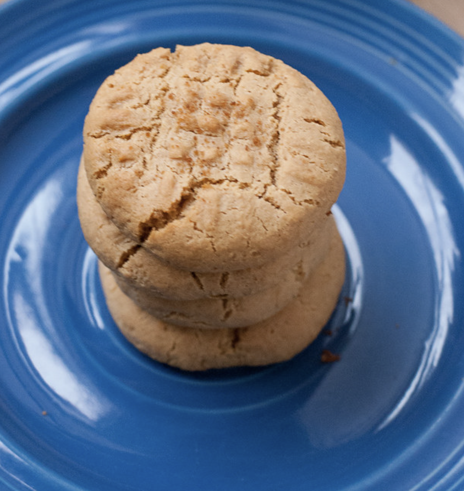

## PREP

# INGREDIENTS

	2 c organic peanut butter (no sugar added, creamy or crunchy)

	4 tbsp coconut oil

	3/4 c honey (il me manquait de miel et j’ai complété avec du sucre de noix de coco= très bon)

	6 eggs (la qté a été augmentée de 4 à 6-7 pcq étaient secs)

	1 tsp vanilla extract

	1 tsp baking soda

	1 tsp baking powder (added)

	1 c coconut flour

	 1/2 t. Pépites mi-sucrées (entre 1/2 et 3/4)

	Pinch salt

	  1/2 t. pacanes hachées  (pourrait être un peu plus) essai avec 3/4 t. Le 28 août

	  1 petite banane (non le 28 août)

# INSTRUCTIONS

 1    Preheat oven to 350. Prepare cookie sheets with either parchment paper or silicone bake mats/

2    Combine the coconut oil and peanut butter and honey in a microwave safe bowl. Microwave for 30 seconds then stir. Microwave for another 30 seconds and if melted, stir again and let cool to room temperature.

3    Combine the coconut flour, baking soda and salt and set aside.

4    Mix the peanut butter mixture until creamy, either with a hand mixer or stand mixer. Add the eggs one at a time and mix well. Add the vanilla and mix again. Add in the flour and mix until just combined.

5    Using a cookie scoop, scoop out a heaping tablespoon amount and roll into 1½” balls, place on cookie sheet 2” apart (and press gently with a fork crosswise for the traditional peanut butter cookie look = not necessary). 

6    Bake for 10 min, just until the edges start to brown. Cool completely on a wire cooling rack.

## NUTRITIONS

## NOTES

The dough will be a little sticky, do not add more coconut flour UNLESS your batter is runny. Then add 2-4 tablespoon more, one tablespoon at a time until its a thicker batter. You can always refrigerate the dough if you think its a bit too runny.

There have been so many people to make these cookies with their own variations that came out awesome. Check the comments for other ways to make them. You can sub any "butter" you want for the peanut butter - almond, cashew, macadamia, sunflower etc. I have not tried them with tahini, not sure how those would be.

## TIPS

##### THE DOUGH WILL BE A LITTLE STICKY, DO NOT ADD MORE COCONUT FLOUR UNLESS YOUR BATTER IS RUNNY. THEN ADD 2-4 TBSP MORE, ONE TABLESPOON AT A TIME UNTIL ITS A THICKER BATTER

