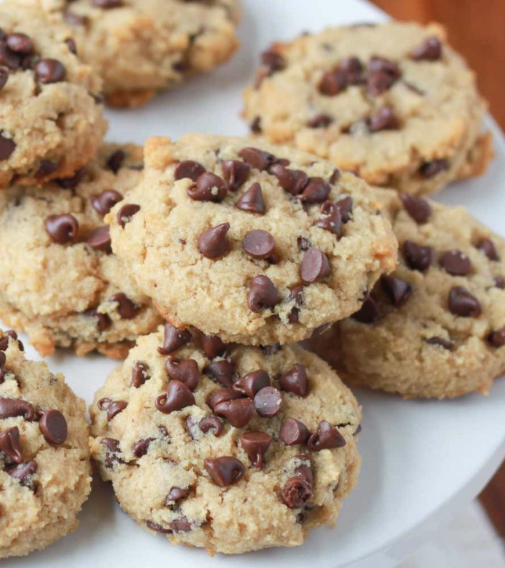

## NOTES

* Flour note: I have used both almond flour and almond meal with success, but a finely ground product made with blanched almonds tends to produce the best cookies

## PREP

# INGREDIENTS

- 2 tablespoons solid coconut oil
- 3 tablespoons pure maple syrup
- 1 large egg
- 1 teaspoon pure vanilla extract
- 2 cups almond flour*
- 1/2 teaspoon baking soda
- 1/4 teaspoon fine-grain sea salt
- 1/2 cup mini semi-sweet chocolate chips + more for topping if desired (we like [Enjoy Life dairy-free chocolate chips](http://amzn.to/1RVKFrk) for a fully dairy-free cookie)

# INSTRUCTIONS

- Preheat oven to 375 degrees Fahrenheit. Line a baking sheet with parchment paper or a silicone mat. Set aside.
    
- Add the coconut oil and the pure maple syrup to a large bowl. If the oil is very hard, microwave for a few seconds until soft but not melted. Stir briskly with a whisk until the syrup and oil are mixed together – this may take a minute or two. Add the egg and vanilla and whisk together until combined.
    
- In a medium bowl, stir together the almond flour, baking soda, and salt. Add the flour mixture to the wet ingredients and stir together with a wooden spoon until combined. Stir in 1/2 cup chocolate chips.
    
- Scoop mounded tablespoonfuls onto the cookie sheet, spacing about two inches apart. Press down gently with your fingers to flatten slightly. Top each with a few additional chocolate chips, if desired.
    
- Bake until set and the edges are golden brown, 8-9 minutes. Remove from oven and let cool for about 5 minutes, then transfer to a wire rack to cool completely.
    
- Cookies keep well in an airtight container at room temperature for 4-5 days.

## NUTRITIONS
Serving: 
1cookie, 
Calories: 101kcal, Carbohydrates: 9g, Protein: 2g, Fat: 6g, Saturated Fat: 2g, Cholesterol: 12mg, Sodium: 55mg, Fiber: 2g, Sugar: 7g

## TIPS

