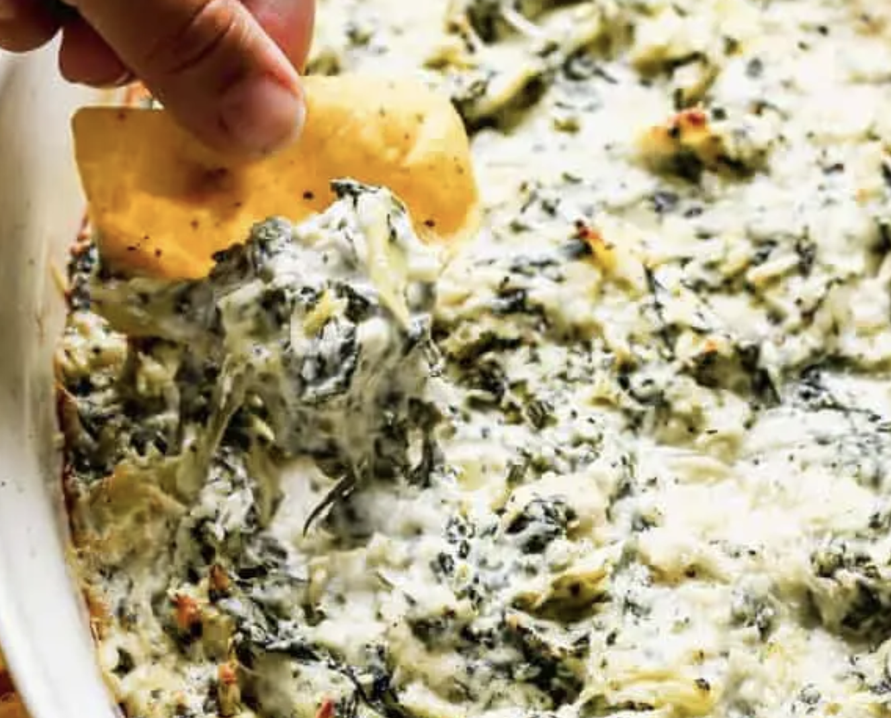

###### *RELATED* : 
---
This EASY Spinach Artichoke Dip recipe is warm, cheesy, and DELICIOUS! It can be made up to 2 days ahead of time, and is always a crowd pleaser!

---
## PREP | COMMENTS

---
# INGREDIENTS

- [ ] 14 ounce can artichoke hearts , drained and chopped
- [ ] ½ cup sour cream
- [ ] 1/2 cup mayonnaise
- [ ] 8 ounces cream cheese , room temperature
- [ ] 1 cup freshly grated parmesan cheese , loosely measured
- [ ] 1 clove garlic minced
- [ ] 1/2 cup spinach , frozen, thawed and liquid squeezed out

---
# INSTRUCTIONS

1. Preheat oven to 350 degrees F.
2. To a mixing bowl add sour cream, mayo, cream cheese, drained spinach, artichoke hearts, garlic and ¾ cup of parmesan cheese. Combine until smooth.
3. Place in a greased baking dish (most pan sizes around 8×8 in or a little smaller will work. You could even use a glass pie dish).
4. Sprinkle remaining ¼ cup of parmesan cheese on top.
5. Bake in preheated oven for about 20 minutes or until hot and bubbly. Serve warm with crackers or bread.

---
## NOTES

Make Ahead Instructions: Prepare the recipe through step 4 (before baking) and store it in the refrigerator for 1-2 days until ready to bake.
  
Freezing Instructions: Prepare the recipe through step 4 (before baking). Place mixture in a freezer safe container or bag and freeze for up to 2 months. Thaw overnight in the refrigerator and return to baking dish before baking.

---
## TIPS

---
## NUTRITIONS

Calories: 164kcalCarbohydrates: 6gProtein: 6gFat: 13gSaturated Fat: 7gPolyunsaturated Fat: 2gMonounsaturated Fat: 3gTrans Fat: 0.01gCholesterol: 34mgSodium: 490mgPotassium: 75mgFiber: 1gSugar: 2gVitamin A: 540IUVitamin C: 1mgCalcium: 124mgIron: 0.1mg

---
### *EXTRA* :

#### **Variations:**

Spinach Artichoke Dip with Fresh Spinach: Cook about 10 ounces of fresh spinach in a skillet with a little drizzle of olive oil. Once the spinach has cooked down, let it cool before squeezing the liquid out of it. I just get a big paper towel, scoop the spinach into it, and gently squeeze it over the sink.

Healthy Spinach Artichoke Dip: Substitute Greek yogurt for sour cream and use low fat cream cheese.

Crockpot Spinach Artichoke Dip: Add everything to the slow cooker and cook on high for 2 hours. Stir well before serving.  

Artichoke Dip without Spinach: use this Artichoke Dip recipe.
