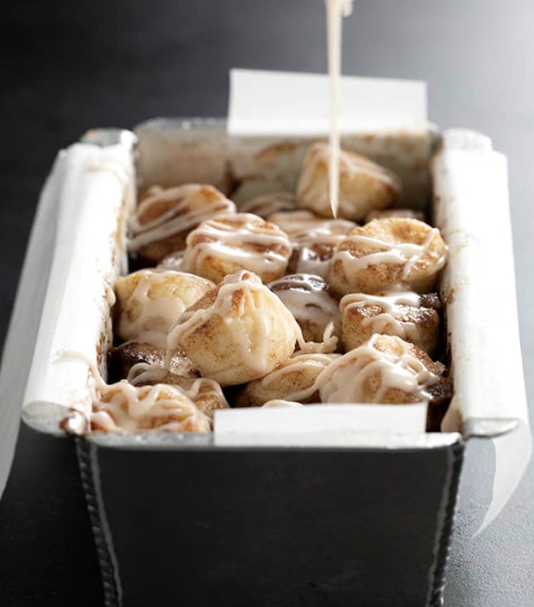

###### *RELATED* : 
---
This recipe for gluten free monkey bread is easy to make, especially for the little hands of little kitchen helpers, and makes the house smell like warm, cinnamon goodness!

---
## PREP | COMMENTS

---
# INGREDIENTS

#### **For the pizza dough***  
- [ ] 2 1/2 cups (350 g) [**all purpose gluten free flour**](https://glutenfreeonashoestring.com/all-purpose-gluten-free-flour-recipes/) (I used Better Batter), plus more for sprinkling
- [ ] 1 1/4 teaspoons xanthan gum (omit if your blend already contains it)
- [ ] 2 1/2 teaspoons baking powder
- [ ] 1 1/4 teaspoons kosher salt
- [ ] 1 7/8 cups (425 g) nonfat Greek-style plain yogurt
- [ ] 1/3 cup (2 2/3 fluid ounces) lukewarm water, plus more by the tablespoon as necessary

#### **For rolling**  

- [ ] 1 cup (200 g) granulated sugar
- [ ] 1 tablespoon ground cinnamon
- [ ] 1/4 teaspoon kosher salt
- [ ] 6 tablespoons (84 g) unsalted butter, melted

#### **For the glaze**  

- [ ] 3/4 cup (86 g) confectioners’ sugar
- [ ] 1 tablespoon milk (any kind), plus more by the 1/4 teaspoonful if necessary

*For a monkey bread that is more likely to hold its shape out of the baking pan or muffin tin wells, use one of our recipes for [**yeasted gluten free pizza dough**](https://glutenfreeonashoestring.com/gf-pizza-dough/).

---
# INSTRUCTIONS

1. Preheat your oven to 350°F. Line a standard 9-inch x 5-inch (or smaller) loaf pan with unbleached parchment paper, making sure that some of the paper extends over the edges of the pan. Set the pan aside. Alternatively, line a standard 12-cup muffin tin with liners and set it aside.
2. To make the pizza dough, in a large bowl, place the flour blend, xanthan gum, baking powder, and salt, and whisk to combine. Add the yogurt and 3 tablespoons of water, and mix until the dough holds together well. If necessary for the dough to clump and hold together easily, without feeling stiff to the touch, add another tablespoon of water and mix to combine. Turn the dough out onto a very lightly floured surface, sprinkle very lightly with more flour, and knead it with clean hands until it’s a bit smoother. Using a rolling pin, roll the dough into a rectangle about 1-inch thick. Using a small round cookie cutter about 1-inch in diameter, cut out rounds of dough, flouring the cutter as necessary to prevent sticking. Do not pack the dough or roll the pieces into a ball. Gather and reroll scraps and place the pieces aside as you work.
3. Place the granulated sugar, cinnamon and salt in a deep, small bowl, and mix to combine well. Place each of the pieces of dough in the melted butter, remove with the tines of a fork to allow excess butter to drip off and place in the bowl of cinnamon sugar. With a fork or spoon, toss to coat and place in the prepared loaf pan or the lined wells of your muffin tin. If using a loaf pan, create a single, even layer of prepared balls of dough on the bottom of the loaf pan, without packing them in, and build up until you reach the top of the loaf pan. You may have some dough left over, depending upon the size of your pan. Press down gently on the dough in the pan. If using a muffin tin, pile about 5 or 6 balls of dough in each well.
4. Place the loaf pan on a baking sheet in case any of the cinnamon-sugar mixture leaks out of the loaf pan. Place the pan (loaf pan or muffin tin) in the center of the preheated oven and bake until very lightly golden brown and the pieces feel firm to the touch. That should take about 25 minutes for the loaf pan, and about 20 minutes for the muffin tin. Remove from the oven and allow to cool for at least 30 minutes in the pan.
5. Make the glaze. In a small bowl, place the confectioners’ sugar and 1 tablespoon of milk. Mix well, until a thick paste forms. Add more milk by the 1/4-teaspoon, mixing to combine well, until the glaze falls off the spoon slowly, in a thick but pourable glaze. Add milk very slowly, as it is much easier to thin, than to thicken, the glaze. If you do thin the glaze too much, add more confectioners’ sugar a teaspoon at a time to thicken it. Drizzle the glaze generously over the top of the bread and serve immediately.

---
## NOTES

---
## TIPS

---
## NUTRITIONS

---
### *EXTRA* :

