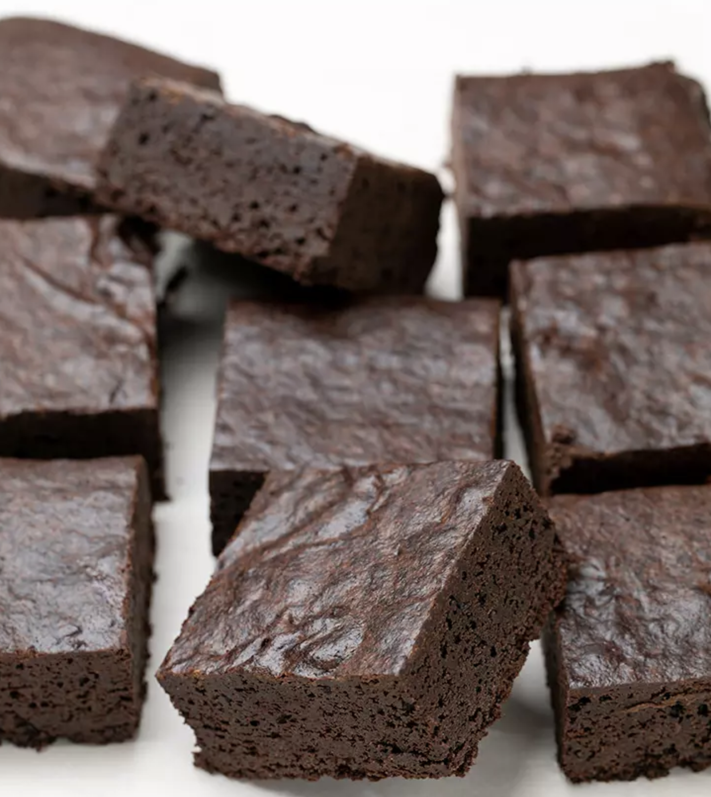

###### *RELATED* : 
---
These super fudgy Paleo brownies are made with plenty of chopped chocolate, finely ground almond flour and a touch of coconut flour for structure, and no refined sugars. They'll be your new favorite—whether you're Paleo or not!

---
## PREP | COMMENTS

 Prep time: 10 minutes Cook time: >25 minutes Yield: 16 brownies (faire 2 recettes)

---
# INGREDIENTS

- [ ] 5 ounces (142g) dark chocolate, chopped
- [ ] 7 tablespoons (84 g) coconut oil [200g  pour 2 recettes 3 mars 2022]
- [ ] 1/4 cup (84 g) honey
- [ ] 3 eggs (180 g, out of shell) at room temperature, beaten
- [ ] 3/4 cup (120 g) coconut sugar (en mettre entre 3/4 et 1t)
- [ ] 1/2 cup (56 g) blanched almond flour
- [ ] 1 tablespoon (8 g) coconut flour
- [ ] 3/4 cup (60 g) unsweetened cocoa powder (either natural or Dutch-processed)
- [ ] 1/8 teaspoon baking soda (omit if using Dutch-processed cocoa powder)
- [ ] [Essai 1/8 c. thé de poudre à pâte le 3 mars 2022]
- [ ] 1/4 teaspoon kosher salt
- [ ] Add some walnuts (1/2t.) (brasse avec une spatule par la suite)

---
# INSTRUCTIONS

1. Preheat your oven to 325°F. Grease an 8-inch square baking pan, and then line it with overhung sheets of crisscrossed unbleached parchment paper. Set the pan aside.
2. Place the chocolate and coconut oil in a small, heat-safe bowl and then place the bowl over a small pan of simmering (not boiling) water, taking care that the bowl doesn’t touch the simmering water.
3. Melt the chocolate and coconut oil, stirring occasionally, until smooth.
4. Remove the bowl from the heat, and add the coconut sugar and honey to the mixture.
5. Whisk to help the coconut sugar to dissolve in the warm mixture, and to integrate the honey.
6. Alternatively, the oil and chocolate can be melted in the microwave in 30-second bursts, stirring in between until melted and smooth before adding the coconut sugar.
7. In a large bowl, place the eggs, and whisk or mix until well-beaten and combined.
8. Add the melted chocolate, oil, and sugars to the bowl slowly, whisking constantly.
9. Add the cocoa powder and whisk until the cocoa powder has been absorbed. Using a handheld mixer, beat until very well-combined.
10. Add the almond flour, coconut flour, baking soda, and salt, and mix with a silicone spatula or spoon until just combined. The batter will be thick and sticky.
11. Transfer the brownie batter to the prepared pan and, using an offset or silicone spatula, spread into an even layer. It helps to moisten the tool you are using to smooth the top a bit to prevent it from sticking.
12. Place the pan in the center of the preheated oven. Bake just until the brownies are no longer wet in the center, about 25 minutes. The brownies will not appear wet and as shiny in the middle, and a toothpick inserted there will come out with only a few moist crumbs, but not wet.
13. Remove the brownies from the oven and allow them to cool in the pan at room temperature until the pan is no longer hot to the touch.
14. For clean lines when you slice the brownies, place the brownies, still in the pan, in the refrigerator to chill for about an hour before slicing them.
15. When you’re ready to slice the brownies, remove them from the pan and peel away the foil. Slice the brownies into 9 or 12 equal rectangles or squares.

---
## NOTES

---
## TIPS

---
## NUTRITIONS

Calories: 285kcal | Carbohydrates: 31g | Protein: 5g | Fat: 18g | Saturated Fat: 13g | Polyunsaturated Fat: 1g | Monounsaturated Fat: 3g | Trans Fat: 0.01g | Cholesterol: 55mg | Sodium: 149mg | Potassium: 247mg | Fiber: 5g | Sugar: 20g | Vitamin A: 85IU | Vitamin C: 0.05mg | Calcium: 30mg | Iron: 3mg

---
### *EXTRA* :

