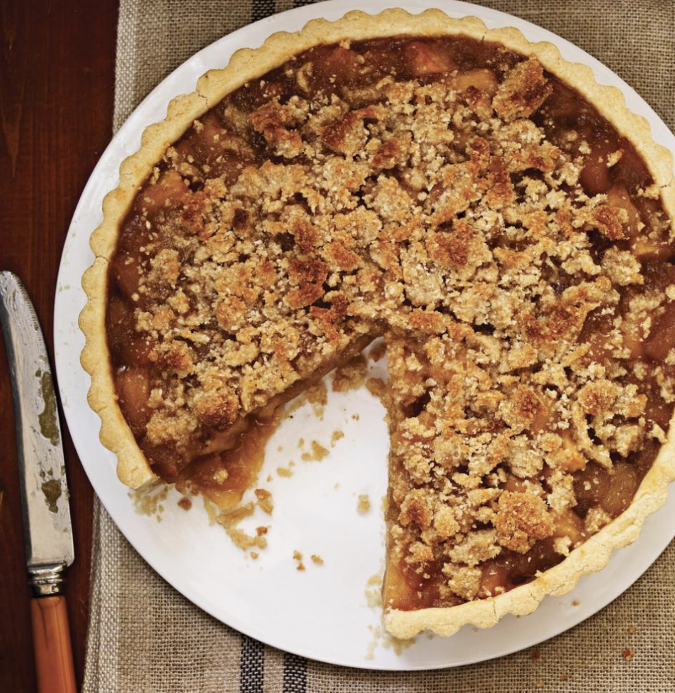

###### *RELATED* : 
---
**Paru dans le Magazine RICARDO Volume 11 Numéro 7** (p. 119)

---
## PREP | COMMENTS

---
# INGREDIENTS

#### Garniture aux pommes

 - [ ] 45 ml (3 c. à soupe) de beurre non salé

 - [ ] 1 tasse (210 g) de sucre

 - [ ] 4 tasses (440 g) de pommes Cortland pelées et coupées en cubes

 - [ ] 4 tasses (440 g) de pommes McIntosh pelées et coupées en cubes


#### Pâte brisée sans gluten

 - [ ] 3/4 tasse (115 g) de farine de riz brun sans gluten
 - [ ] 1/2 tasse (70 g) de fécule de maïs sans gluten

 - [ ] 1/2 tasse (100 g) de fécule de pommes de terre sans gluten

 - [ ] 1 ml (¼ c. à thé) de sel

 - [ ] 3/4 tasse (170 g) de beurre non salé froid, coupé en dés

 - [ ] 1 oeuf, légèrement battu
 - [ ] 15 ml (1 c. à soupe) d’eau froide


#### Crumble

 - [ ] 60 ml (25 g) de flocons d’avoine pure (voir note), réduits en poudre au moulin à café

 - [ ] 60 ml (25 g) de cassonade

 - [ ] ½ tasse (65 g) de poudre d’amandes

 - [ ] 2 c. à soupe (30 ml) de beurre non salé, ramolli

---
# INSTRUCTIONS

#### 1. Garniture aux pommes

Dans une grande poêle antiadhésive, fondre le beurre. Ajouter le sucre de manière à ce qu’il couvre le fond de la poêle. Cuire à feu moyen jusqu’à ce qu’il soit fondu et prenne une couleur dorée. Ajouter les pommes et bien remuer à la cuillère de bois jusqu’à ce que les pommes McIntosh soient compotées et les Cortland fondantes, soit environ 10 minutes. Laisser refroidir complètement, le temps de préparer la pâte.

#### 2. Pâte brisée sans gluten

Au robot culinaire, mélanger la farine, les fécules et le sel. Ajouter le beurre et mélanger quelques secondes à la fois jusqu’à ce que le beurre ait la grosseur de petits pois. Ajouter l’oeuf et l’eau. Mélanger de nouveau jusqu’à ce que la pâte commence tout juste à se former. Retirer la pâte du robot et former deux disques avec les mains. Couvrir d’une pellicule de plastique et réfrigérer 30 minutes.

#### 3. Placer la grille dans le bas du four. Préchauffer le four à 200°C (400°F).

#### 4. Entre deux feuilles de papier parchemin

Abaisser une pâte et foncer un moule à tarte à fond amovible de 23 cm (9 po) de diamètre et de 2,5 cm (1 po) de hauteur. Réserver l’autre disque de pâte pour un autre usage. Verser la garniture aux pommes refroidie. Réserver.

Crumble

    5    Dans un bol, déposer l’avoine, la cassonade et la poudre d’amandes. Ajouter le beurre et mélanger du bout des doigts jusqu’à ce que les ingrédients soient humectés. Répartir sur la tarte. Cuire au four de 25 à 30 minutes ou jusqu’à ce que le crumble soit bien doré. Laisser refroidir sur une grille.

    6    

Si vous trouvez votre pâte trop fragile après l’avoir abaissée entre les deux feuilles de papier parchemin, réfrigérez-la quelques minutes. Le papier se décollera facilement de la pâte et celle-ci sera plus facile à déposer dans le moule.

---
## NOTES

Sur le marché, l’avoine pure est commercialisée sous trois marques : Château Cream Hill, Only Oats et Bob Red’s Mill. À défaut d’en trouver, vous pouvez aussi préparer le crumble avec des flocons de quinoa certifiés sans gluten.  
  
Si vous trouvez votre pâte trop fragile après l’avoir abaissée entre les deux feuilles de papier parchemin, réfrigérez-la quelques minutes. Le papier se décollera facilement de la pâte et celle-ci sera plus facile à déposer dans le moule.

---
## TIPS

---
## NUTRITIONS

---
### *EXTRA* :

