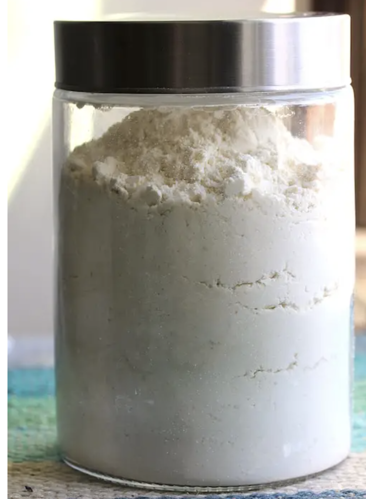

###### *RELATED* : 
---

---
## PREP | COMMENTS

---
# INGREDIENTS

- [ ] 500 grams potato starch (NOT potato flour)
- [ ] 250 grams white rice flour
- [ ] 250 grams brown rice or sorghum flour
- [ ] 200 grams tapioca starch
- [ ] 170 grams chickpea or besan flour
- [ ] 30 grams xanthan gum

---
# INSTRUCTIONS

1. In a extra large ziplock bag, bowl, or plastic bin, mix together all the ingredients. Make sure to weigh all ingerdients carefully.

2. Mix the flour until very well combined.

---
## NOTES

---
## TIPS

---
## NUTRITIONS

---
### *EXTRA* :

