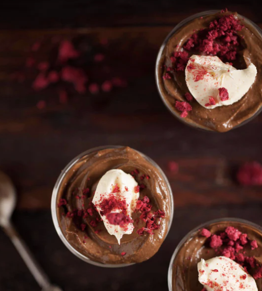

###### *RELATED* : 
---
A velvety smooth chocolate mousse that’s guilt-free and loaded with superfoods and antioxidants. My purely delicious chocolate mousse is made from ripe avocado that is blended with [Naked Chocolat](https://secure.thehealthychef.com/shop/drinking-chocolate) and scented with pure Madagascan vanilla and a pinch of artisan sea salt. The addition of coconut cream will make the texture light and delicious.

---
## PREP | COMMENTS

---
# INGREDIENTS

- [ ] 2 ripe avocados, skin and stone removed
- [ ] 60 g (2 oz / 1/2 cup) cacao or [Naked Chocolat](https://secure.thehealthychef.com/shop/drinking-chocolate)
- [ ] 125 ml (4 fl oz / ½ cup) organic maple syrup
- [ ] 125 ml (4 fl oz / 1/2 cup) coconut cream
- [ ] 60 ml (2 fl oz / ¼ cup) cold-pressed coconut oil
- [ ] 1 teaspoon vanilla bean extract
- [ ] Pinch of sea salt

---
# INSTRUCTIONS

1. Combine avocado, [Naked Chocolate](https://secure.thehealthychef.com/shop/drinking-chocolate), maple syrup, coconut cream, coconut oil, vanilla and sea salt.
    
2. Blend until smooth and creamy.
    
3. Divide into serving glasses or Kliner glass serving jars.
    
4. Refrigerate for 2 - 3 hours to chill completely or enjoy immediately if you can't wait that long.
    
5. Decorate with whipped coconut cream or mascarpone, then garnish with freeze-dried raspberries.
    
6. Enjoy the ultimate chocolate indulgence.

---
## NOTES

This mousse is delicious on its own or used as a topping for cakes and cupcakes.
  
The addition of cold pressed coconut oil will firm up the mousse.
  
I love to serve this mousse as part of a dessert served with smashed raspberries or spread over a fresh made [chocolate cake](https://www.thehealthychef.com/2013/08/healthy-chocolate-cake/).

---
## TIPS

---
## NUTRITIONS

---
### *EXTRA* :

