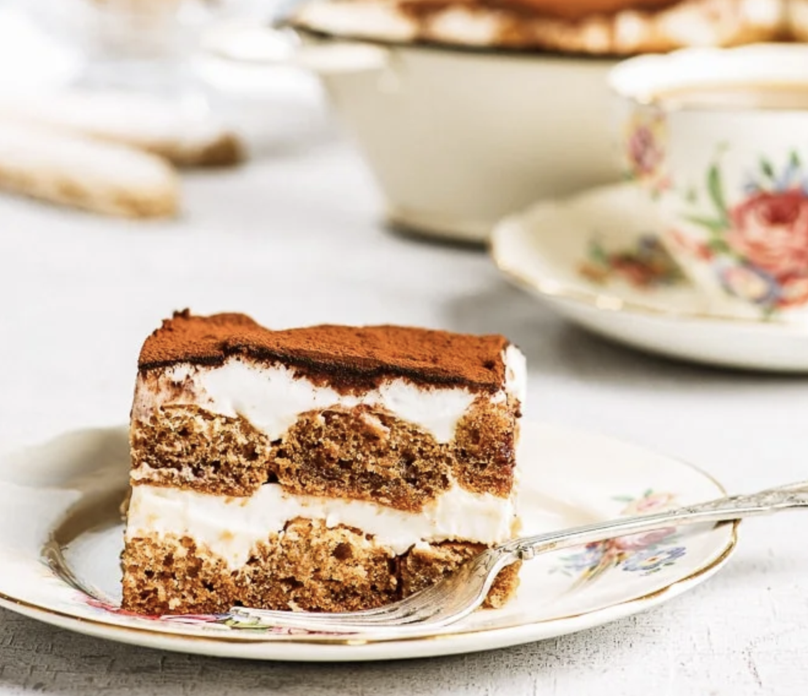

###### *RELATED* : 
##### TIRAMISU [previous versions] : 
[[Tiramisu 1]] 
[[Tiramisu 2]]
[[Tiramisu 3]]

#### LADYFINGERS : 
[[The Perfect Gluten Free Ladyfingers]]
 
---
Official Tiramisu Recipe

---
## PREP

Prep35 m Cook10 m Ready In 5h

---
# INGREDIENTS

- [ ] 6 egg yolks
- [ ] 3/4 cup white sugar
- [ ] 2/3 cup milk
- [ ] 1 pound mascarpone cheese
- [ ] 4 cups heavy cream
- [ ] 1 t. sucre en poudre
- [ ] 2 teaspoon vanilla extract
- [ ] 2 tablespoons Amaretto (ou rum ou Brandy)
- [ ] 2 (+1/2) cups strong brewed coffee, room temperature unsweetened (expresso ou passé deux fois dans des grains de café) Mettre le café dans un plat avec un fond droit (petit plat rectangulaire) pour faciliter le trempage des doigts de dame.
- [ ] cocoa powder

---
# INSTRUCTIONS

1. Make 2 cups of strong coffee and let cool.
2. In a medium saucepan, whisk together egg yolks and sugar until well blended. Whisk in milk and cook over medium heat, stirring constantly, until mixture boils. Boil gently for 1 minute, remove from heat and allow to cool slightly. Cover tightly and chill in refrigerator 1 hour. 
3. In the meantime, in a medium bowl beat cream with vanilla and Amaretto (or other liquor) if using until stiff peaks form. (J'ai ajouté 1 t. de sucre de canne en poudre)
4. Whisk mascarpone into yolk mixture until smooth.
5. Mix with the whipped cream Arrange half of soaked in coffee ladyfingers in bottom of a 7x11 inch dish. Spread some of the cream mixture over the ladyfingers. Repeat the layers but put a thin layer this second time and then spoon the leftover cream and a piping bag and pipe dollops on top. (See video [https://www.biggerbolderbaking.com/easy-10-minute-tiramisu/](https://www.biggerbolderbaking.com/easy-10-minute-tiramisu/) )Sprinkle with cocoa. Cover and refrigerate 4 to 6 hours (or overnight), until set. (Au moins 24 heures)

---
## NOTES

_The ingredients listed below are sufficient for an oval serving dish of approximate dimensions: width=8 inch (21 cm), length=12 inch (30 cm). You can easily adapt the recipe to different serving dish sizes by increasing/decreasing the quantities_

---
## TIPS

---
## NUTRITIONS

---
### *EXTRA* :

