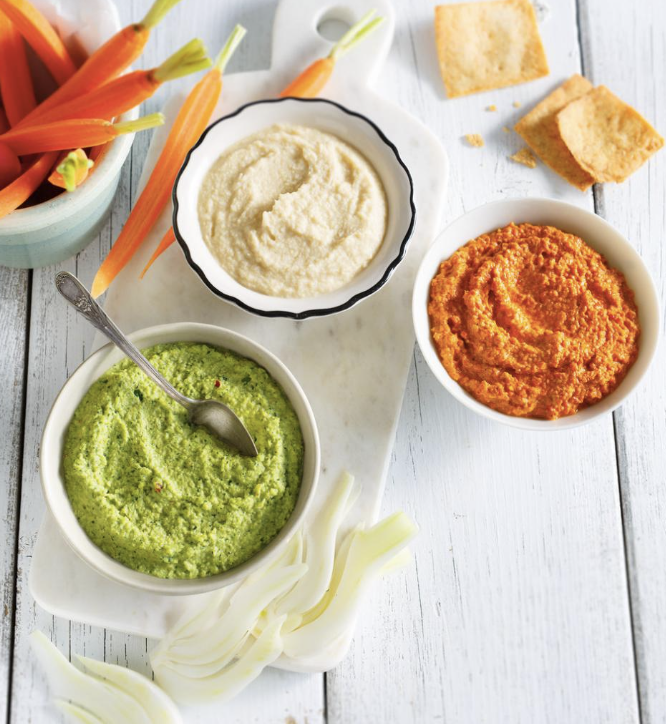

###### *RELATED* : 
---

---
## PREP | COMMENTS

---
# INGREDIENTS

- [ ] 2/3 tasse (150 ml) sauce style mayonnaise ½ moins de gras Hellmann’s®
- [ ] 2/3 tasse (150 ml) yogourt grec nature sans gras
- [ ] 1/2 tasse (125 ml) concombre, râpé
- [ ] 2 cuillères à soupe (30 ml) ciboulette fraîche, hachée
- [ ] 1 cuillère à soupe (15 ml) aneth frais , haché
- [ ] 1 cuillère à thé (5 ml) flocons d’oignon déshydratés

---
# INSTRUCTIONS

1. Mélanger la sauce style mayonnaise ½ moins de gras Hellmann’s® et tous les autres ingrédients dans un bol. Servir avec vos légumes préférés pour tremper.

---
## NOTES

---
## TIPS

---
## NUTRITIONS

---
### *EXTRA* :

