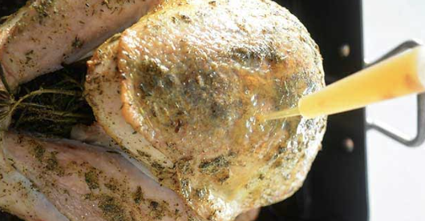

###### *RELATED* : 
---
Roast turkey has been a major focal point of holiday celebrations, most especially in the U.S. According to the University of Illinois Extension, Americans consume roughly 46 million turkeys annually during Thanksgiving, 22 million during Christmas and 19 million during Easter.1

While there are many tried-and-tested ways of preparing turkey, why not try something new and healthy the next time you plan to roast it? Created by Jennafer Ashley of PaleoHacks, this [turmeric and roast honey turkey](https://blog.paleohacks.com/roast-turkey/) recipe will be the star of your dining table, whether during holiday gatherings or relaxed get-togethers. The honey and turmeric combination may be new for some people, but it’s sure to satisfy the taste buds of anyone who tries it.

---
## PREP | COMMENTS

Prep time: **20 minutes** Cook time: **2 hours and 30 minutes** 
Total time: **2 hours and 50 minutes**

---
# INGREDIENTS

#### For the turkey:

- [ ] 1 whole organic cage free turkey (ideal weight is 11 pounds)
- [ ] 4 cups [organic turkey broth](https://recipes.mercola.com/turkey-bone-broth-recipe.aspx)
- [ ] 4 tablespoons grass fed butter, cut into slices
- [ ] 4 rosemary sprigs
- [ ] 1 teaspoon rubbed sage
- [ ] 1 teaspoon [thyme](https://foodfacts.mercola.com/thyme.html)
- [ ] 1 teaspoon sea salt
- [ ] 1/2 teaspoon onion powder
- [ ] 1/2 teaspoon black pepper
    
#### **For the Honey Turmeric Glaze:**

- [ ] 4 tablespoons grass fed butter
- [ ] 1 teaspoon ground turmeric
- [ ] 2 tablespoons raw honey
- [ ] 1 tablespoon minced garlic
- [ ] 1 teaspoon sea salt

---
# INSTRUCTIONS

1. Begin by thawing the turkey according to package directions.|

2. Heat oven to 325 degrees F and move oven rack to the bottom. Remove giblets and rinse entire turkey with cool water. Pat dry with paper towel. Place turkey into roasting pan on rack. Neatly position wings behind turkey.
3. Place sprigs of rosemary in cavity of turkey. Mix together sage, thyme, onion powder, sea salt and black pepper in a small bowl.

4. Use fingers to lift the skin of the turkey near the thighs and rub grass fed butter underneath as well as on top. Next, rub dry seasoning under the skin and all over the top of turkey. Pour turkey broth into pan.
5. Insert an oven-safe meat thermometer into the thickest part of the thigh without touching bone. Place turkey in oven and roast for one hour, uncovered.

6. Carefully remove turkey from oven. Baste turkey with broth. If you find that the broth has evaporated, add 2 cups of broth to the pan, allow it to mix with the drippings, and then baste as normal.
7. Place the lid on the roasting pan and return to the oven
8. Continue to cook the turkey, basting every 45 minutes until the thermometer reaches 165 degrees F. Cooking time will vary with the size of turkey (the rule of thumb is 13 minutes per pound).

9. Melt grass fed butter for glaze over medium/low heat, stir in honey, turmeric, garlic and sea salt until smooth. Use a basting brush to cover turkey with glaze. Return turkey to oven for 20 minutes, uncovered.

10. Allow turkey to rest 20 minutes before carving.

---
## NOTES

---
## TIPS

---
## NUTRITIONS

---
### *EXTRA* :

## Health Benefits of Top-Notch Turkey

While cooking a whole turkey takes a lot of time, seeing your finished product being enjoyed by family and friends is definitely worth the effort. However, not all roast turkey is created equal, since some birds may be marinated or cooked with potentially harmful trans fats, or the bird itself may harbor unwanted substances or pathogens.

If you’re looking for more reasons to eat turkey outside the holidays, look at its nutrition content. Turkey is a very high-protein food that’s rich in B vitamins (particularly B3, B6 and B12)2 and selenium, which may serve as a potent antioxidant and help reduce your risk for chronic diseases.3 It also has been shown to possess other nutrients like:4

|   |   |
|---|---|
|Folate|[Potassium](https://articles.mercola.com/vitamins-supplements/potassium.aspx)|
|Iron|Zinc|
|Copper|Phosphorus|
|Magnesium|Fatty acids|

One compound in turkey that stands out is an amino acid called tryptophan.5 Although it’s present in low quantities in turkey,6 you can still benefit from it since [tryptophan](https://articles.mercola.com/vitamins-supplements/tryptophan.aspx) is needed to produce niacin that’s essential for serotonin production. Serotonin is important because it can assist with boosting mood and alertness,7 and may work with [melatonin](https://articles.mercola.com/vitamins-supplements/melatonin.aspx) to regulate sleeping patterns.

However, to reap tryptophan’s benefits, you need to regularly consume turkey and other foods containing this amino acid such as pumpkin seeds, nuts and free-range organic eggs. The body doesn’t produce essential amino acids like tryptophan, so you must replenish your body’s stores of them through your diet.

When buying turkey, the World’s Healthiest Foods suggests looking for organic, [pasture-raised birds](https://foodfacts.mercola.com/organic-pasture-raised-chicken.html) that were sourced from a local farmer. This way, you ensure that the turkeys are more nutrient-rich since they were allowed to forage and look for food, and not fed contaminated or unhealthy substances.8

Avoid processed turkey products because these may contain excessive amounts of sodium that may cause adverse effects. MedicalNewsToday notes that processed turkey meats are often smoked or made using sodium nitrites. These may combine with amines (another compound naturally present in the meat) to create N-nitroso compounds that are known carcinogens.9

## Why Is Raw Honey Good for You?

In this recipe, [raw honey](https://foodfacts.mercola.com/raw-honey.html) provides just the right amount of sweetness to complement the turkey’s savory meat. It has much more to offer, though, compared to the ultra-processed and excessively sweet varieties found in most commercial stores. Royal jelly, propolis and bee pollen, all of which are found in raw honey, contain good amounts of antioxidants, vitamins and minerals.10 Raw honey has also been linked to benefits such as:

- **Enhancing gut bacteria** — A 2006 BMC Complementary & Alternative Medicine animal study revealed that when honey was used in place of sugars in processed food, harmful and genotoxic effects of mycotoxins were prevented and gut microflora was improved.11
- **Possessing antibacterial capabilities** — A 2011 Biotechnology Research International article noted that raw and processed honey was found to have antibacterial properties against gram-positive and gram-negative strains.12
- **Increasing your body’s ability to ward off allergies** — According to WebMD, raising the body’s immunity against pesky allergies may be achieved by consuming more locally produced raw honey.13

If you’re interested in purchasing raw honey, contact a trustworthy source like a local organic beekeeper who may be residing in your area. Ensure that the final product is unfiltered, local and 100 percent pure.

## Terrific Turmeric: Why You Should Keep This Spice at Hand

Although this recipe calls for a very small amount of turmeric, this bright-colored spice can make a big impact. Turmeric, which has a warm and bitter taste, is mainly added to curries and other Asian dishes.14 It may not be a common ingredient in typical roast turkey, but once you realize what its health-boosting capabilities are, you may just find yourself using it for your dishes more often.

[Curcumin](https://articles.mercola.com/vitamins-supplements/curcumin.aspx), a polyphenol in turmeric, is mainly responsible for some of the spice’s health benefits. Some studies have suggested that curcumin may play a role in combating:15

- Diabetes
- [Obesity](https://articles.mercola.com/obesity.aspx)
- Neurologic and psychiatric disorders16
- Chronic illnesses targeting your eyes, lung, liver, kidneys and gastrointestinal and cardiovascular systems

Other research conducted on curcumin has highlighted its potential to reduce your risk for various cancers.17,18,19,20 A 2012 Cochrane Database of Systematic Reviews article also showed that curcumin may help in the remission of ulcerative colitis (UC).21 Curcumin’s other digestive system-related benefits don’t stop here, as this compound’s ability to promote bile production in your gallbladder may be useful for targeting digestive disorders,22 enhancing digestion23 and alleviating bloating and gas.24