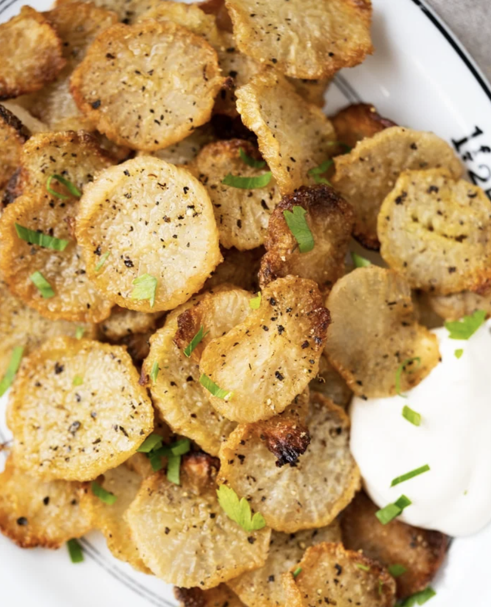

###### *RELATED* : 
---
Radishes have never tasted _this_ good (and so potato-like)! With this unique cooking method, expect true keto faux-tatoes: **silky smooth** yet **lightly crisp**!

---
## PREP | COMMENTS

PREP TIME 15minutes mins
COOK TIME 1hour hr
TOTAL TIME 1hour hr 15minutes mins

---
# INGREDIENTS

- [ ] 1 1/2-2 cups **[extra virgin olive oil](https://amzn.to/2AFTOsK)** *
- [ ] 1 daikon radish (roughly 1 1/2 lbs), peeled & sliced crosswise
- [ ] 1/4 medium white onion very thinly sliced crosswise
- [ ] [kosher salt](https://amzn.to/2uM2LxM)** to taste
- [ ] freshly ground black pepper to taste

---
# INSTRUCTIONS

1. Heat up olive oil in a skillet or dutch oven over medium heat until it begins to simmer. Turn your heat down to low and add in the radish and onion slices, seasoning with a bit of salt as you layer them. Stir occasionally until tender, silky smooth and fully cooked (40-60 minutes, depending on size and thickness). Feel free to slice them ultra thin and cook them longer for crisp edges! 
2. Drain the radishes and onions once cooked (you can discard the onions if you wish) 
3. enjoy!

---
## NOTES

**No need to use anything fancy or splurge, as long as it's extra virgin and cold pressed (and you like the taste) you're good to go.

And if you're looking to hide the olive oil taste a bit, you can always use a neutral one (such as [Bertoli extra light](https://amzn.to/2BkPwVU)); just keep in mind they're more refined. 

Also keep in mind that I've noticed the amount of oil you need depends on how thin you slice your radishes (duh?); so start with the lower amount and you can always add more (or cook in batches).  

Please note that nutrition facts are a bit tricky to estimate for these (calorie and fat-wise, as it depends on how much oil they soak up). In my experience a little over half of the olive oil gets left behind.

---
## TIPS

---
## NUTRITIONS

Calories: 350kcal | Carbohydrates: 3.25g | Protein: 0.5g | Fat: 35g | Saturated Fat: 5g | Sodium: 18mg | Potassium: 190mg | Fiber: 1.25g | Sugar: 2g | Vitamin C: 18.2mg | Calcium: 22mg | Iron: 0.6mg

---
### *EXTRA* :

