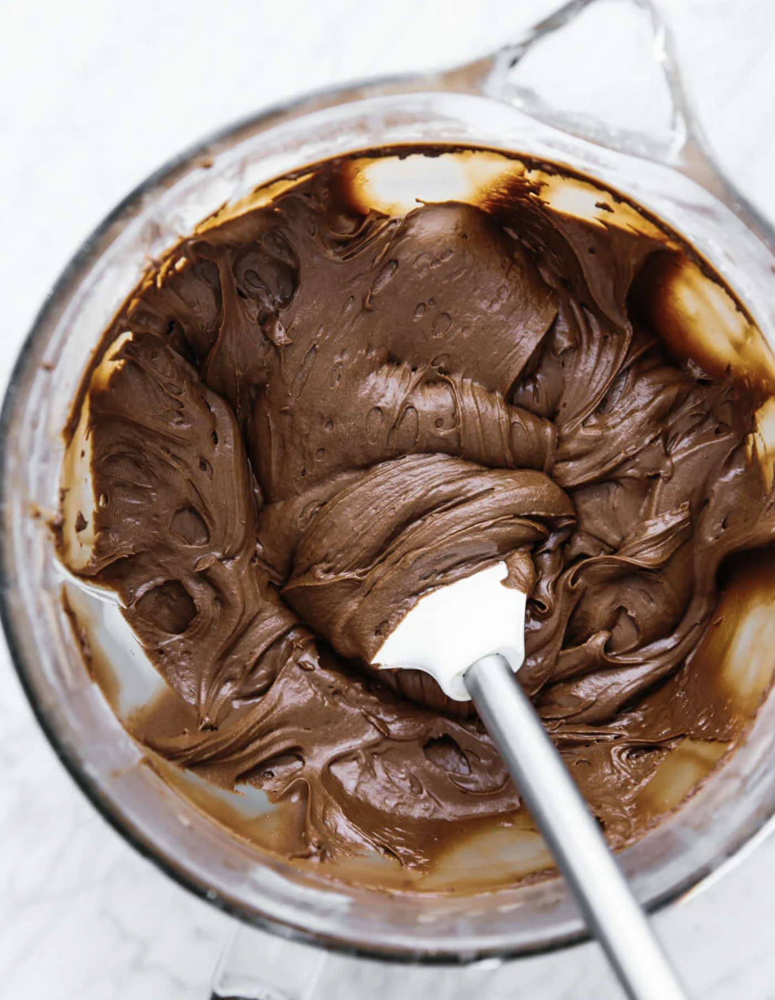

###### *RELATED* : 
---
This **vegan chocolate buttercream frosting** is dairy-free and can be modified into a paleo buttercream frosting as well. It’s luxuriously rich, creamy and decadent. The perfect frosting for a chocolate cake or cupcakes.

---
## PREP | COMMENTS

**PREP TIME:** 15 mins
**TOTAL TIME:** 15 mins
**SERVINGS:** 16 servings

---
# INGREDIENTS

- [ ] 8 cups [[Powdered Sugar]], or powdered coconut sugar, powdered succanat, etc
- [ ] 1 cup [raw cacao powder](https://amzn.to/3MGQnVo)
- [ ] 1 cup [organic palm shortening](https://amzn.to/3ol8Opp), or vegan butter or a combination of both
- [ ] 1/2-3/4 cup [almond milk](https://downshiftology.com/recipes/how-to-make-almond-milk/), cashew milk or coconut milk
- [ ] 2 tsp [vanilla extract](https://amzn.to/3McT2Vm)

---
# INSTRUCTIONS

1. Add all ingredients to a stand mixer and blend on low for 30 seconds. 
2. Once the ingredients have started to combine, slowly increase the speed to high and blend for one minute.
3. To thin the consistency (if needed) add more milk, or to thicken add more powdered sugar.

---
## NOTES

---
## TIPS

- This recipe makes approximately 3 cups of frosting.
- I highly recommend the [beater blade](http://amzn.to/2BliLGB) if you have a KitchenAid stand mixer. It scrapes the sides and beats at the same time, which is awesome.
    
- It's really easy to make cashew milk, for use in this recipe and others. Make sure to check out my recipe and video on [homemade cashew milk](https://downshiftology.com/videos/make-cashew-milk-dairy-free/).

---
## NUTRITIONS

CALORIES: 366.1KCAL | CARBOHYDRATES: 63G | PROTEIN: 1G | FAT: 13.6G | SATURATED FAT: 6G | SODIUM: 6.6MG | FIBER: 1G | SUGAR: 58.8G

---
### *EXTRA* :

