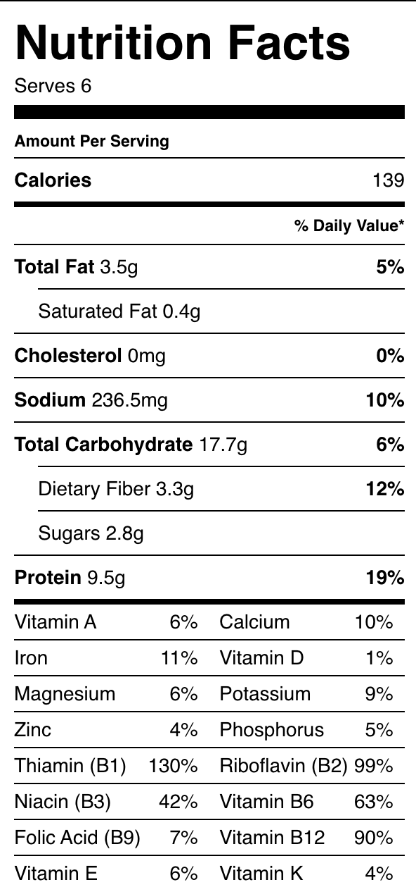

###### *RELATED* : 
---
This vegan vegetable frittata using a creamy tofu base is loaded with veggies. Perfect for a hearty breakfast/brunch and leftovers store well. Recipe adapted from [PETA](http://www.peta.org/recipes/vegan-vegetable-frittata/).

---
## PREP | COMMENTS

I suggest using at least a 9 inch round dish or larger.

---
# INGREDIENTS

- [ ] 1 tablespoon **olive oil** or 1/4 cup **water** (for water saute)
- [ ] 2 medium **potatoes**, diced (with or without the skin)
- [ ] 1 small **onion**, diced
- [ ] 1 **bell pepper**, diced
- [ ] 1 **zucchini**, diced
- [ ] 2 cloves **garlic**, minced
- [ ] handful grape **tomatoes**, halved or quartered
- [ ] pinch of **red pepper flakes**, optional
- [ ] mineral **salt and pepper**, to taste

#### for the blender/food processor

- [ ] 1 package (16 oz) **organic silken tofu** (soft or firm), drained (no pressing needed)
- [ ] 1/4 cup **unsweetened non-dairy milk**
- [ ] 2 heaping teaspoons **cornstarch**, arrowroot or tapioca flour
- [ ] 2 – 3 tablespoons **nutritional yeast**
- [ ] 1 teaspoon **mustard** (any kind) or 1/2 teaspoon mustard powder
- [ ] 1 1/2 teaspoons dried **tarragon**, thyme or basil (or a combo)
- [ ] 1/2 teaspoon **garlic powder**
- [ ] 1/2 teaspoon **salt**
- [ ] 1/4 teaspoon **turmeric**
- [ ] 1/8 teaspoon **pepper** (black or white)

---
# INSTRUCTIONS

1. Preheat oven to 375 degrees F.
2. **Saute:** Heat oil in a pan over medium heat, saute potatoes for 5 minutes, add onion and cook an additional 5 minutes. Add bell pepper, zucchini and garlic, cook until softened. Add tomatoes and optional red pepper flakes, cook another minute or two. Season with salt and pepper to taste.
3. **Tofu egg**: In a food processor/blender, combine the remaining ingredients and process until smooth. Taste for seasoning.
4. **Assemble:** Add the tofu mixture to the pan the vegetables cooked in and mix well. Spoon mixture into a lightly greased 9 inch round pie/quiche dish or springform pan. Level the top flat with the back of a spatula or spoon and make sure all edges are filled.
5. **Bake:** Place on the middle rack and bake for 35 – 45 minutes, frittata should be firm to the touch. If top starts to brown too much, cover with foil or small silpat. Remove and let cool for at least 10 minutes. If using a pie/quiche dish, loosen the edges of the frittata, place a plate over top and carefully flip so frittata falls onto the plate and serve (this step is optional).
6. This frittata is wonderful with sliced avocado and a little sriracha for heat.
7. Serves 4 – 6
8. **Store**: Leftovers can be stored in the refrigerator for 4 – 5 days. To keep longer, store in the freezer using freezer safe containers for up to 2 – 3 months.

---
## NOTES

I suggest using at least a 9 inch round dish or larger.

Nutritional information is calculated using water to saute, there is no oil accounted for.

---
## TIPS

---
## NUTRITIONS

---
### *EXTRA* :

