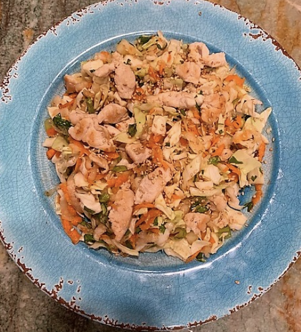

###### *RELATED* : 
---

---
## PREP | COMMENTS

---
# INGREDIENTS

- [ ] **1 Tbsp avocado oil**
- [ ] **¾ pound chicken breast, very thinly sliced**
- [ ] **¼ tsp sea salt**
- [ ] **1 stalk lemongrass, trim the top and base of the stalk—use only the bottom 3 inches; peel off any dry or tough outer layers, then mince**
- [ ] **1 tsp ginger root, peeled and diced**

#### **Salad:**

- [ ] **2 cups cabbage, thinly sliced**
- [ ] **2 medium carrots, grated**
- [ ] **1 cup daikon radish (1 small daikon radish), grated**
- [ ] **¼ cup fresh basil, chopped**
- [ ] **¼ cup mint, chopped**
- [ ] **¼ cup fresh cilantro, chopped**

#### **Dressing:**

- [ ] **2 Tbsp macadamia nut oil**
- [ ] **Juice of 1 lime (~ 3 Tbsp)**
- [ ] **1 tsp Tamarind paste**
- [ ] **2 tsp sesame oil**
- [ ] **½ tsp Tamari sauce**
- [ ] **1 tsp honey**

#### **Garnish:**

- [ ] **2 tsp sesame seeds**

---
# INSTRUCTIONS

1. **Heat a sauté pan to medium-high heat, add oil, then chicken (or other protein), salt, lemongrass, and ginger root. Stir occasionally until lightly browned, about 6-7 minutes, then set aside.**
2. **Combine salad ingredients in a serving bowl.**
3. **Whisk dressing ingredients until mixed. Toss with the salad and chicken.** 
4. **Garnish with sesame seeds and serve.**
5. **Enjoy**

---
## NOTES

---
## TIPS

---
## NUTRITIONS

---
### *EXTRA* :

