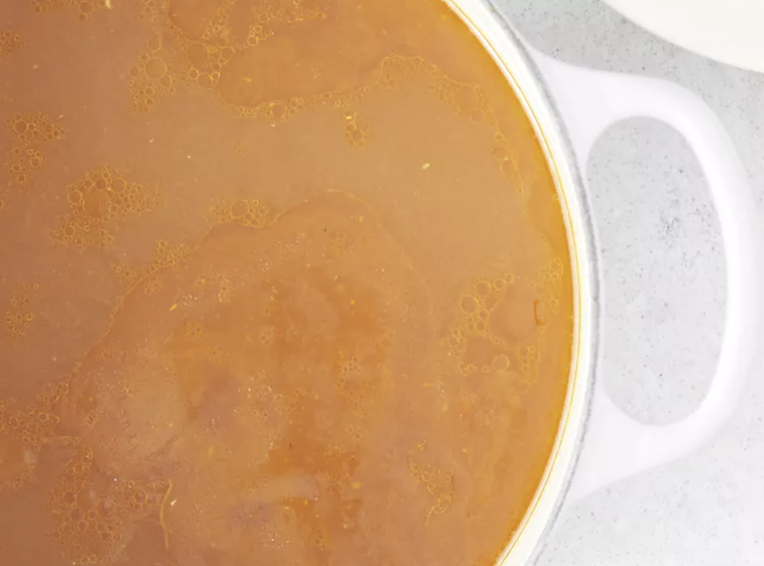

###### *RELATED* : 

This vegan broth is slightly thick with rich color and full flavor. The broth can be frozen in 1- or 1 1/2-cup blocks for later use. This recipe also leaves you with a bowl full of deliciously cooked vegetables.

## PREP

Original recipe yields 8 servings

Yield: 2 quarts

# INGREDIENTS

• 
1 pound celery

• 
1 ½ pounds sweet onions

• 
1 pound carrots, cut into 1 inch pieces

• 
1 pound tomatoes, cored

• 
1 pound green bell pepper, cut into 1 inch pieces

• 
½ pound turnips, cubed

• 
2 tablespoons olive oil

• 
3 cloves garlic

• 
3 whole cloves

• 
1 bay leaf

• 
6 whole black peppercorns

• 
1 bunch fresh Italian parsley, chopped

• 
1 gallon water (4.6L)

# INSTRUCTIONS

Step 1 -  Preheat oven to 450 degrees F (230 degrees C).


Step 2 -  Remove leaves and tender inner parts of celery and set aside.



Step 3 - Toss onions, carrots, tomatoes, bell peppers and turnips with olive oil. Place vegetables in a roasting pan and place them in the 450 degrees F (230 degrees C) oven. Stir the vegetable every 15 minutes. Cook until all of the vegetables have browned and the onions start to caramelize, this will take over one hour.



Step 4 - Put the browned vegetables, celery, garlic, cloves, bay leaf, pepper corns, Italian parsley and water into a large stock pot. Bring to a full boil. Reduce heat to simmer. Cook uncovered until liquid is reduced by half.

Step 5 - Pour the broth through a colander, catching the broth in a large bowl or pot. The liquid caught in the bowl or pot is your vegetable broth it can be used immediately or stored for later use. Although the vegetables are no longer necessary for your broth they are delicious to eat hot or cold, don't waste them!

## NUTRITIONS

Per Serving: 133 calories; protein 3.5g; carbohydrates 23.3g; fat 4g; sodium 131.5mg.

## NOTES

## TIPS

### *EXTRA*

